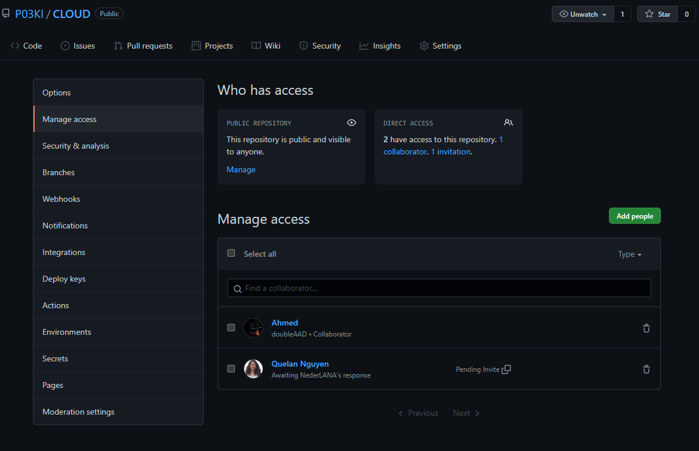

# Git en GitHub

Introductie Git & Github

## Key-terms

Git is open-source en gratis te gebruiken. Het is het meest gebruikte versiebeheer systeem op het moment van schrijven. Dit is mede doordat Git projecten van alle formaten aankan.

Github is een Git hosting service in de cloud van Microsoft. Github laat je Git repositories hosten en managen. Daarnaast maakt GitHub nog vele andere functies beschikbaar om je Git repositories te beheren. 

## Opdracht

Maak een GitHub account als je er nog geen hebt
Maak een repository op je GitHub account voor je portfolio
Geef permissies aan je teamgenoten om de repository te gebruiken
Push je code naar je repository
Pull / Clone een repository van je peer.

## Opdracht 2

Maak een nieuwe repository aan voor je portfolio
Push je notities naar de repository
Deel deze repository met je Learning Coach

### Gebruikte bronnen

<https://github.com/>

### Ervaren problemen

Geen

### Resultaat

