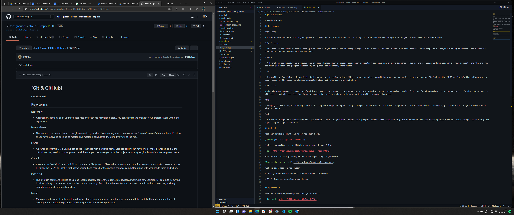

# [Git & Markdown]

Introductie Markdown met Git.

## Key-terms

VCS

- Een versiebeheersysteem of VCS (Engels: Version Control System) is een computerprogramma of een verzameling programma's waarmee men de wijzigingen in documenten, programma's of andere informatie bewaard in computerbestanden kan beheren. Een VCS wordt het meest gebruikt bij de ontwikkeling van software, zodat meerdere mensen wijzigingen kunnen aanbrengen aan dezelfde bestanden. Wijzigingen worden meestal aangeduid met een code, het "revisienummer" of "revisieniveau". Elke wijziging wordt gekoppeld aan een timestamp en aan de persoon die de wijziging maakte. Wijzigingen kunnen vergeleken worden, hersteld en soms samengevoegd.

Markdown

- Markdown is een lichtgewicht opmaaktaal op basis van platte tekst die zodanig ontworpen is dat het gemakkelijk valt te converteren naar HTML en andere formaten met een applicatie met dezelfde naam. Markdown wordt vaak gebruikt voor de opmaak van projectdocumentatie (README-bestanden), eenvoudige CMS-systemen en berichten in online fora. Tekst in deze opmaaktaal is gemakkelijk te maken met een simpele teksteditor.

Het ontwerpdoel van de taal is leesbaarheid. Teksten geschreven met behulp van Markdown worden geacht al leesbaar te zijn voordat opmaak is toegepast op de tekst. Opmaakinstructies en tags zijn dan ook niet te vinden in pure Markdown.

WYSIWYG vs WYSIWYM

- Wysiwyg is een acroniem voor What you see is what you get of in het Nederlands: wat je ziet is wat je krijgt. De term wordt gebruikt voor computerprogramma's en betekent dat je direct op het beeldscherm ziet hoe het resultaat op papier eruit komt te zien, inclusief alle opmaak: vet, letterafmeting etc.

In de begintijd van de pc (in de jaren 80 tijdens het DOS-tijdperk) had geen enkel programma wysiwyg, omdat de grafische mogelijkheden op het beeldscherm nog erg beperkt waren. Hierdoor kon de opmaak van documenten niet exact weergegeven worden op het scherm. WordPerfect 5.1. was bijvoorbeeld een niet-wysiwyg tekstverwerker. Deze situatie veranderde met de invoering van de VGA-standaard en het Windows 3.0-besturingssysteem, dat gebruikmaakte van de door VGA geboden mogelijkheden.

Rond 1990 verschenen de eerste programma's met wysiwyg voor de pc, en daardoor werden de computerprogramma's toegankelijker voor de gewone consument.

In de Unix-wereld en in de natuur-wetenschappelijke, academische wereld zijn tegenstanders van de wysiwyg-gedachte te vinden.

Men stelt zich op het standpunt dat de (zichtbare) opmaak afleidt van het schrijven van de inhoud. Hier wordt eerder gebruikgemaakt van systemen op basis van TeX. Om zich af te zetten tegen de hype die rond wysiwyg ontstond, werd het acroniem WYSIWYM gebruikt: What You See Is What You Mean. Uit de door de gebruiker gestructureerde invoer wordt daarbij door de computer een uitvoer gegenereerd volgens de regels van het oude zet-handwerk.

## Opdracht

Maak een document met je gekozen editor.

### Gebruikte bronnen

<https://code.visualstudio.com/>

<https://nl.wikipedia.org/>

### Ervaren problemen

Geen.

### Resultaat

Opdrachten GIT01 en GIT02 voltooid en pushed to Github via VSC.
