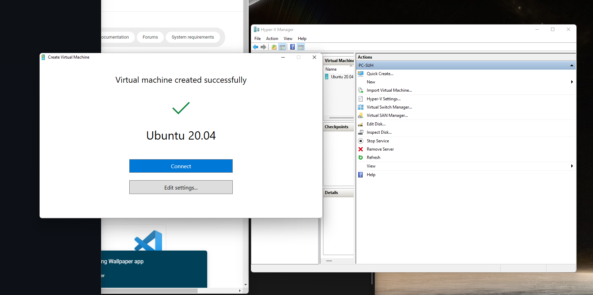
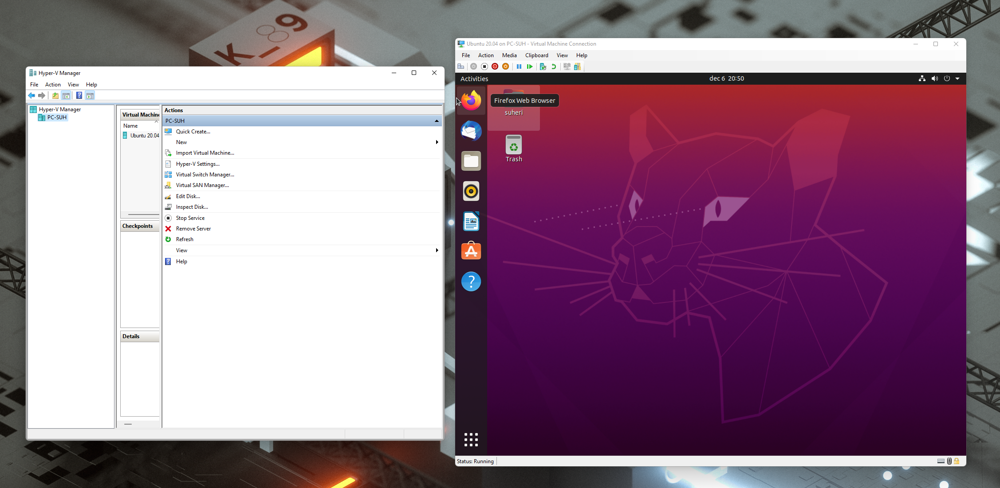
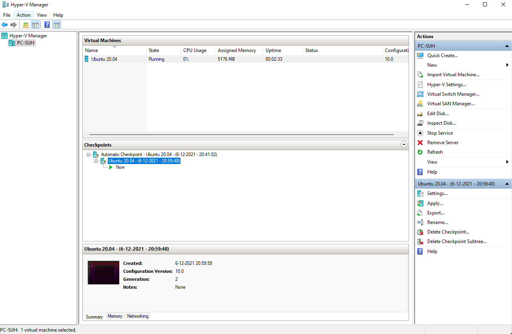
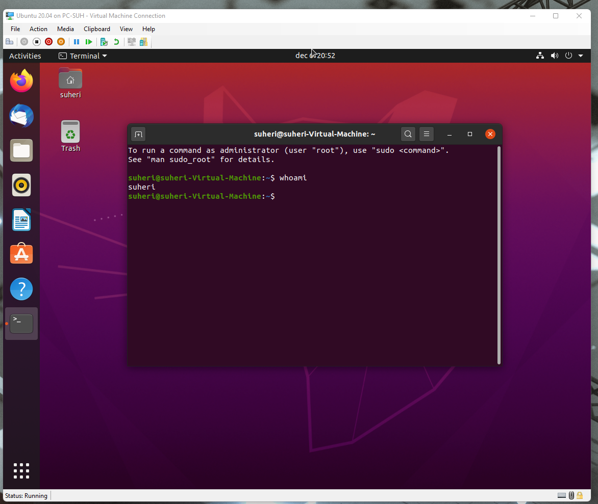

# VM Installeren

Linux via VM draaien op Windows 11.

## Key-terms

WSL(2)

- Microsoft introduceerde Windows Subsystem for Linux 2 bij de Windows 10 May 2020 Update van begin dit jaar. Met het subsysteem richt Microsoft zich op ontwikkelaars die bijvoorbeeld Linux-tools binnen Windows willen gebruiken. In plaats van op een relatief eenvoudige compatibiliteitslaag, zoals bij WSL1, is de tweede versie gebaseerd op een virtuele machine waarbinnen een door Microsoft zelf ontwikkelde opensource-Linux-kernel en de usermode van Linux draaien. Microsoft werkt eraan om Linux-bestanden binnen WSL vanuit de Verkenner te kunnen openen.

Hyper-V

- Hyper-V is een native hypervisor van Microsoft voor virtualisatie. Met de software kan men virtuele machines creëren op x86-64-systemen, waarop vervolgens Windows kan draaien.

De term 'native' wil zeggen dat er geen besturingsysteem tussen ligt, hierdoor kunnen er meer bronnen, zoals werkgeheugen, aan de virtuele machines toegewezen worden. Dit type hypervisor wordt dan vooral ook gebruikt voor servers.

## Opdracht

Install a Linux virtual machine on your laptop.

Once installation and setup are complete, take a snapshot of the VM. This will act as a checkpoint in case you break the machine on accident (or on purpose).

Go to the terminal in your VM and type ‘whoami’. The terminal should show your username

### Gebruikte bronnen

<https://docs.microsoft.com/en-us/windows/wsl/install>

<https://docs.microsoft.com/en-us/virtualization/hyper-v-on-windows/quick-start/enable-hyper-v>

### Ervaren problemen

Geen

### Resultaat

Zie screenshots bij Opdracht.
