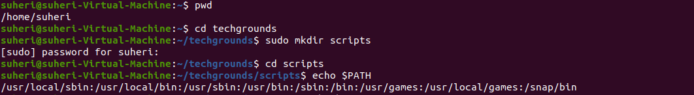
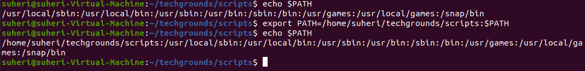
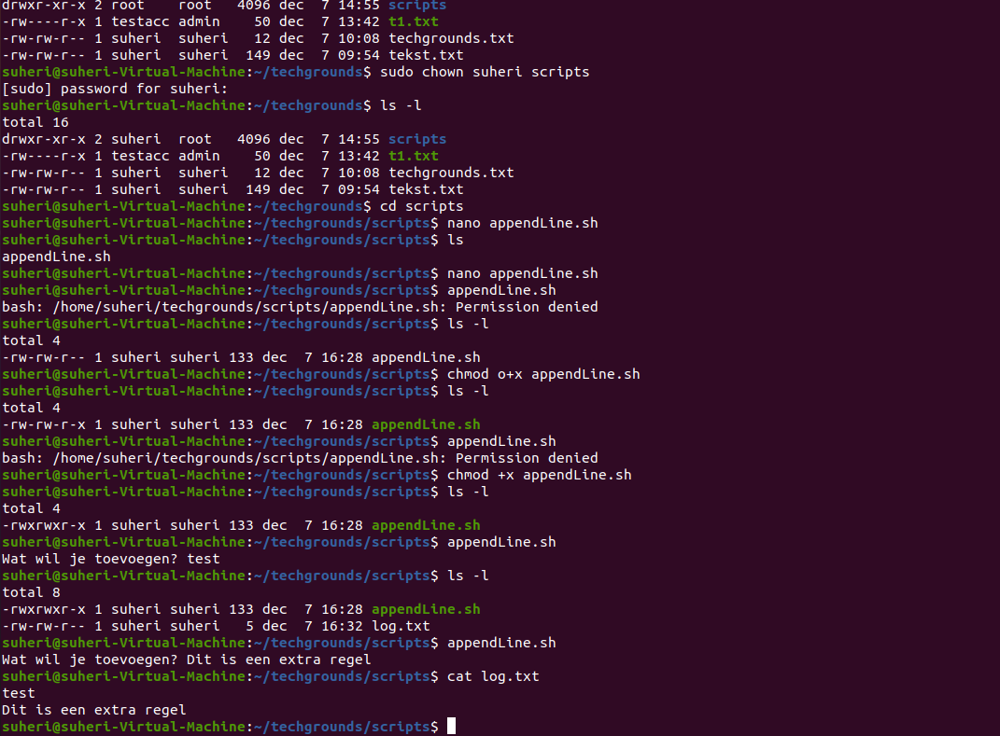
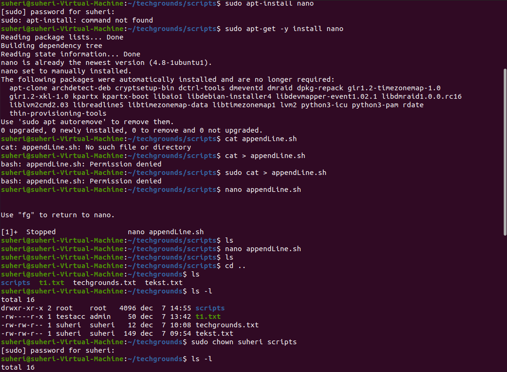

# Bash scripting

Start met scripting in BASH.

## Key-terms

## Opdracht 1

- Create a directory called ‘scripts’. Place all the scripts you make in this directory.

- Add the scripts directory to the PATH variable.

- Create a script that appends a line of text to a text file whenever it is executed.

- Create a script that installs the httpd package, activates httpd, and enables httpd. Finally, your script should print the status of httpd in the terminal.

Variables:

You can assign a value to a string of characters so that the value can be read somewhere else in the script.
Assigning a variable is done using ‘=’.
Reading the value of a variable is done using ‘$<insert variable name here>’.

### Gebruikte bronnen

<https://www.howtogeek.com/658904/how-to-add-a-directory-to-your-path-in-linux/>

### Ervaren problemen

SSH status report bleef continue updaten zodat ik geen prompt meer kreeg. CTRL-Q en CTRL-X geen effect. Opgezocht hoe dit te stoppen. Antwoord "q".

### Resultaat

Zie screenshots bij Opdracht.
