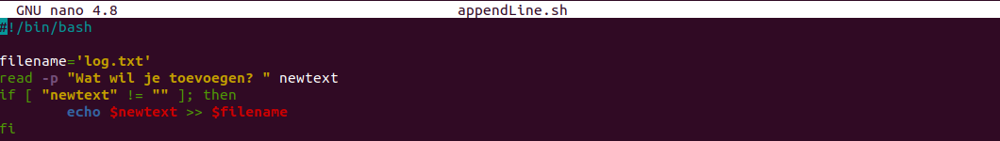
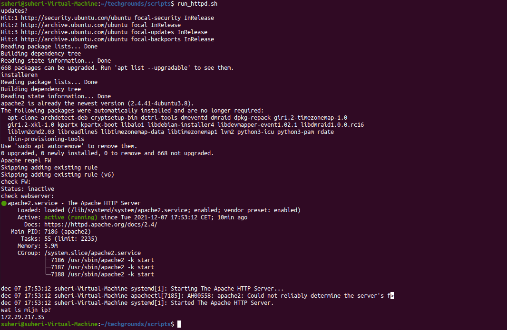
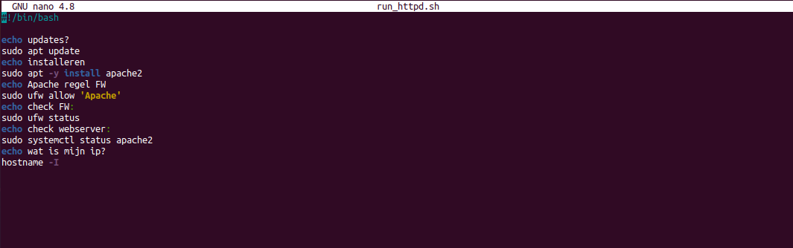

# Bash scripting

Start met scripting in BASH.

## Key-terms

## Opdracht 1

- Create a directory called ‘scripts’. Place all the scripts you make in this directory.

- Add the scripts directory to the PATH variable.

- Create a script that appends a line of text to a text file whenever it is executed.

- Create a script that installs the httpd package, activates httpd, and enables httpd. Finally, your script should print the status of httpd in the terminal.

### Gebruikte bronnen

<https://www.howtogeek.com/658904/how-to-add-a-directory-to-your-path-in-linux/>

<https://askubuntu.com/questions/409025/permission-denied-when-running-sh-scripts>

<https://linuxhint.com/bash_append_line_to_file/>

<https://www.digitalocean.com/community/tutorials/how-to-install-the-apache-web-server-on-ubuntu-20-04>

### Ervaren problemen

Geen echte obstakels.

### Resultaat

Zie screenshots bij Opdracht.
