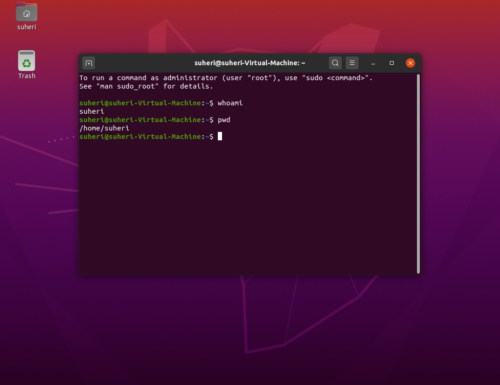
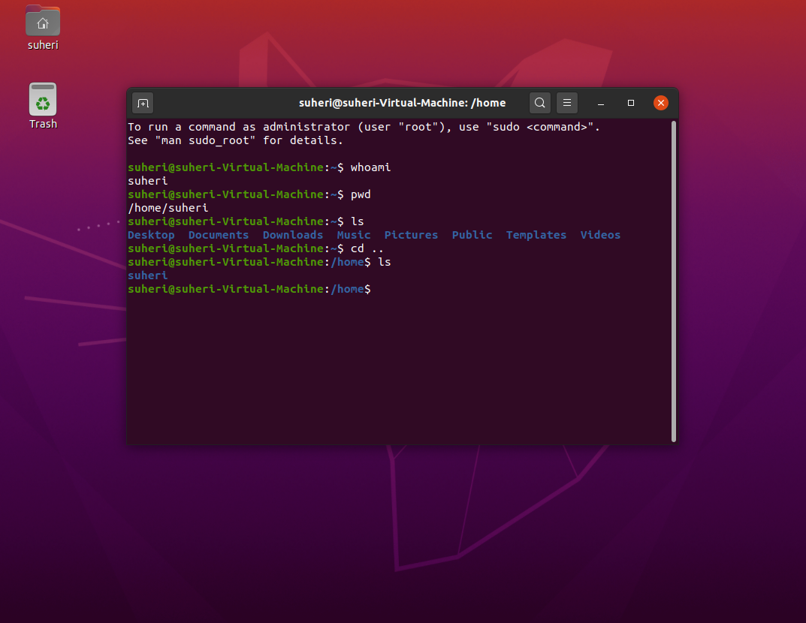
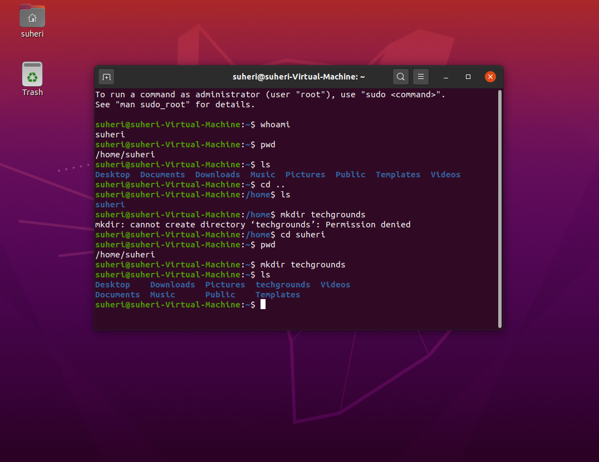
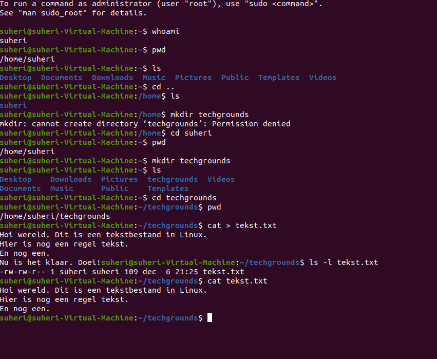
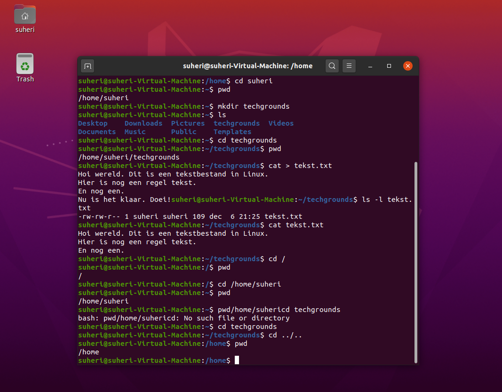

# Files and directories

Benaderen van bestanden en folders via CLI in Linux.

## Key-terms

## Opdracht

Find out your current working directory.

Make a listing of all files and directories in your home directory. You should see directories like ‘Desktop’, ‘Public’ and ‘Pictures’ among others.

Within your home directory, create a new directory named ‘techgrounds’.

Within the techgrounds directory, create a file containing some text.

Move around your directory tree using both absolute and relative paths.

### Gebruikte bronnen

<https://cheatography.com/davechild/cheat-sheets/linux-command-line/>

<https://www.howtogeek.com/199687/how-to-quickly-create-a-text-file-using-the-command-line-in-linux/>

<https://www.geeksforgeeks.org/absolute-relative-pathnames-unix/>

### Ervaren problemen

Geen

### Resultaat

Zie screenshots bij Opdracht.
