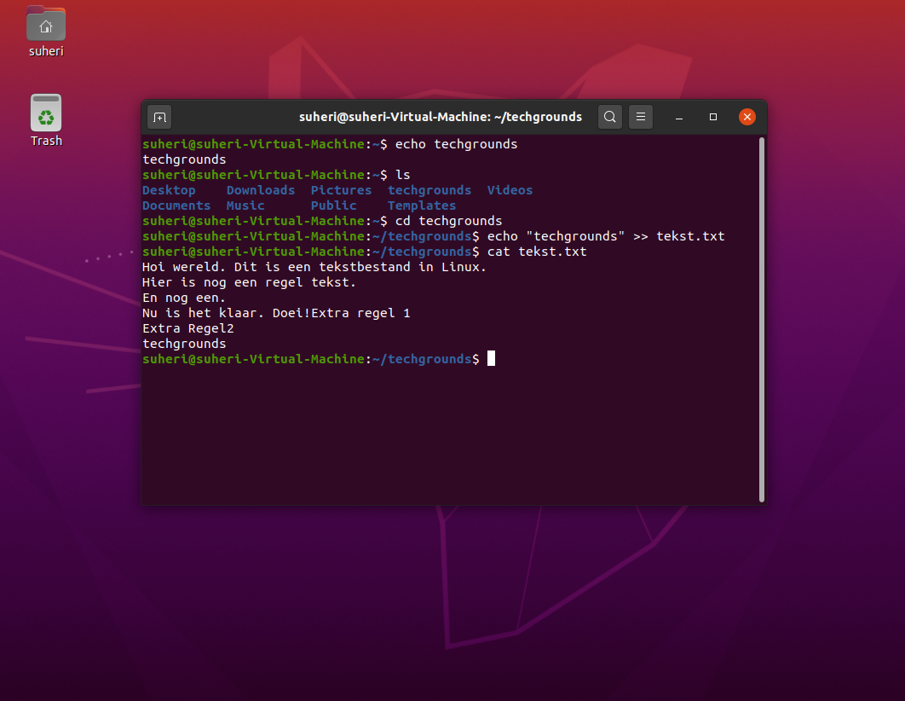
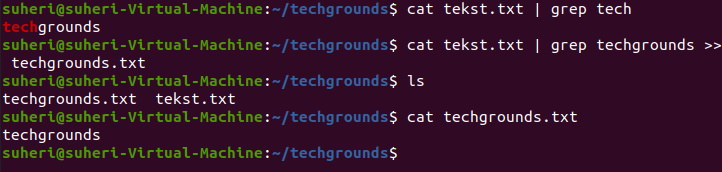

# Working with text (CLI)

Input en output middels CLI.

## Key-terms

- Cheat-sheet CLI commands

## Opdracht

- Use the echo command and output redirection to write a new sentence into your text file using the command line. The new sentence should contain the word ‘techgrounds’.

- Use a command to write the contents of your text file to the terminal. Make use of a command to filter the output so that only the sentence containing ‘techgrounds’ appears.

- Read your text file with the command used in the second step, once again filtering for the word ‘techgrounds’. This time, redirect the output to a new file called ‘techgrounds.txt’.

### Gebruikte bronnen

<https://cheatography.com/davechild/cheat-sheets/linux-command-line/>

<https://unix.stackexchange.com/questions/219268/how-to-add-new-lines-when-using-echo>

<https://stackoverflow.com/questions/4712521/filtering-linux-command-output>

### Ervaren problemen

Geen

### Resultaat

Zie screenshots bij Opdracht.
