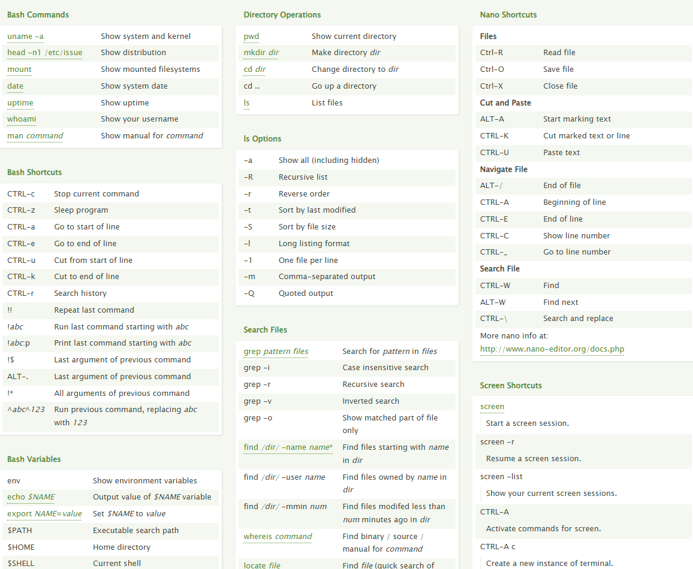

# Users and groups

Omgaan met gebruikers, groepen en rechten.

## Key-terms

- Cheat-sheet CLI commands

## Opdracht

- Create a new user in your VM.

- The new user should be part of an admin group that also contains the user you created during installation.

- The new user should have a password.

- The new user should be able to use ‘sudo’

- Locate the files that store users, passwords, and groups. See if you can find your newly created user’s data in there.

### Gebruikte bronnen

<https://cheatography.com/davechild/cheat-sheets/linux-command-line/>

<https://www.techrepublic.com/article/how-to-quickly-give-users-sudo-privileges-in-linux/>

<https://www.linux.com/topic/desktop/how-manage-users-groups-linux/>

### Ervaren problemen

Geen

### Resultaat

Zie screenshots bij Opdracht.
