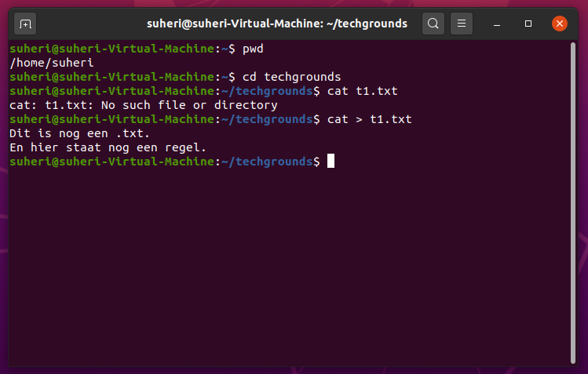
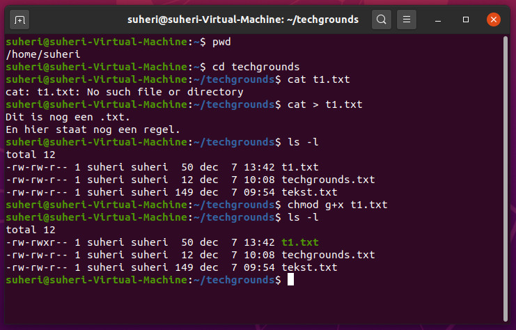
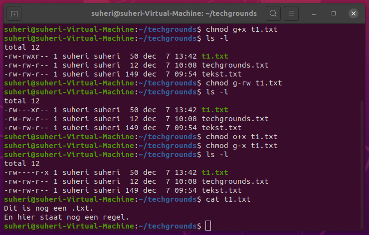
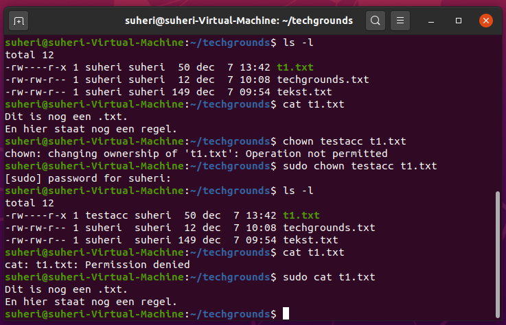
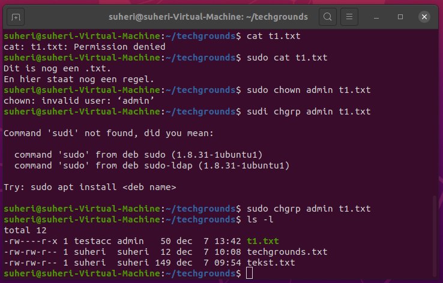

# File permissions

Omgaan met rechten van bestanden en folders.

## Key-terms

- Cheat-sheet CLI commands

## Opdracht

- Create a text file.

- Make a long listing to view the file’s permissions. Who is the file’s owner and group? What kind of permissions does the file have?

- Make the file executable by adding the execute permission (x).

- Remove the read and write permissions (rw) from the file for the group and everyone else, but not for the owner. Can you still read it?

- Change the owner of the file to a different user. If everything went well, you shouldn’t be able to read the file unless you assume root privileges with ‘sudo’.

- Change the group ownership of the file to a different group.

### Gebruikte bronnen

<https://cheatography.com/davechild/cheat-sheets/linux-command-line/>

<https://www.pluralsight.com/blog/it-ops/linux-file-permissions>

<https://docs.oracle.com/cd/E19683-01/816-4883/6mb2joat3/index.html>

### Ervaren problemen

Geen

### Resultaat

Zie screenshots bij Opdracht.
