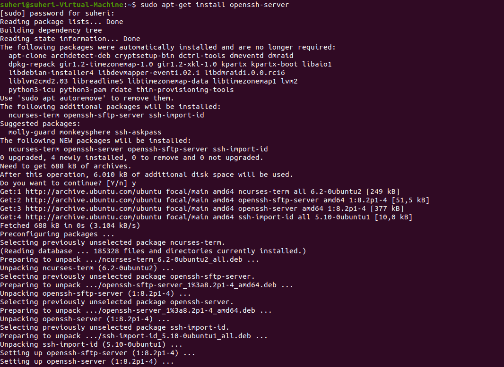
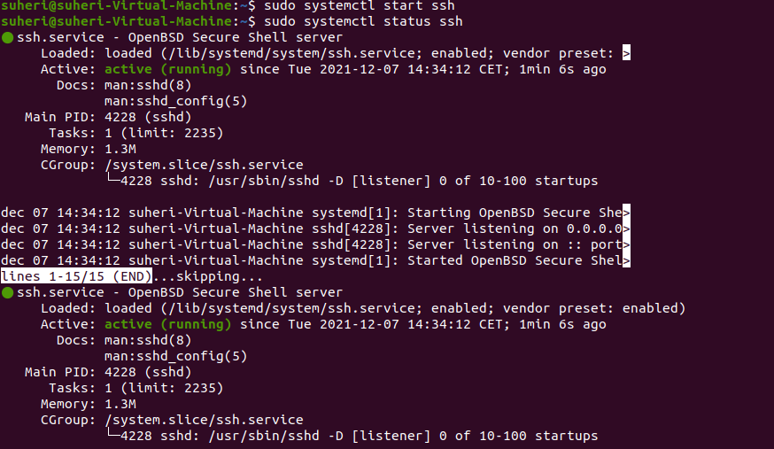

# Processes

Omgaan met rechten van bestanden en folders.

## Key-terms

- Cheat-sheet CLI commands

## Opdracht

- Start the ssh daemon.

- Find out the PID of the ssh daemon.
- Find out how much memory the sshd is using.

- Stop or kill the sshd process.

### Gebruikte bronnen

<https://cheatography.com/davechild/cheat-sheets/linux-command-line/>

<https://www.cyberciti.biz/faq/howto-start-stop-ssh-server/>

<https://askubuntu.com/questions/1161579/ssh-server-cannot-be-found-even-though-installed>

<https://askubuntu.com/questions/961025/how-do-i-exit-the-systemctl-status-commands-output>

### Ervaren problemen

SSH status report bleef continue updaten zodat ik geen prompt meer kreeg. CTRL-Q en CTRL-X geen effect. Opgezocht hoe dit te stoppen. Antwoord "q".

### Resultaat

Zie screenshots bij Opdracht.
