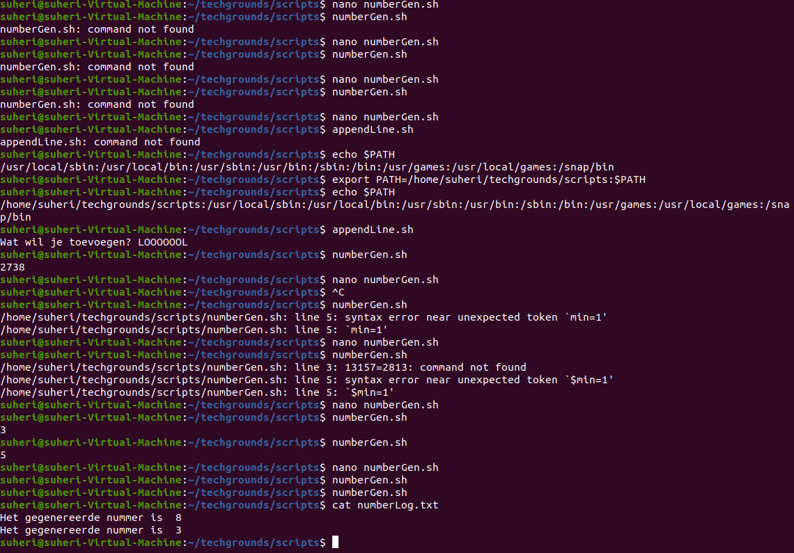
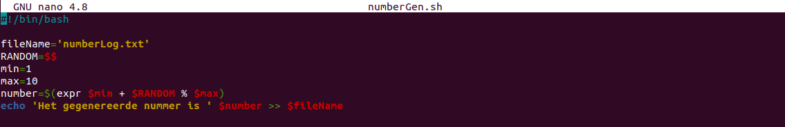
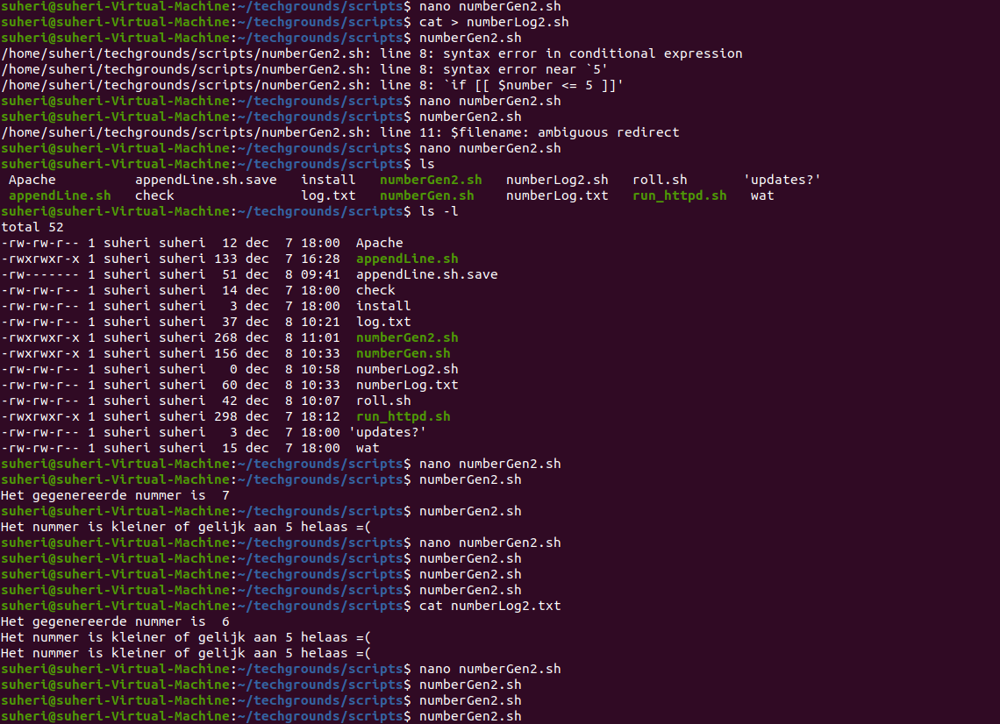
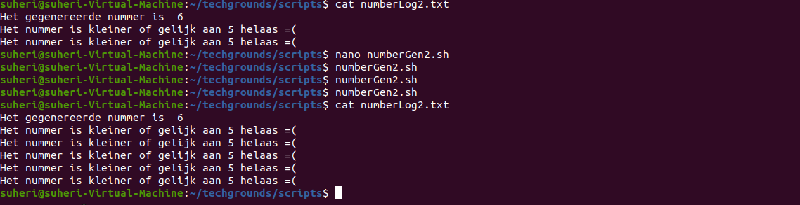
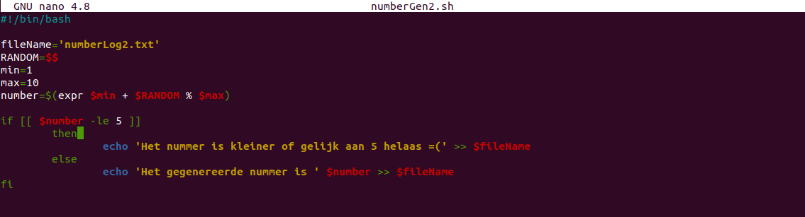

# Bash scripting

Start met scripting in BASH.

## Key-terms

- BASH

Bash, wat staat voor Bourne Again Shell, is een shell voor POSIX-systemen en wordt onder andere gebruikt op Linux en macOS. Het is geschreven door GNU en is sterk geïnspireerd op sh (afgeleid van de eerste twee letters van shell (Engels voor omhulsel)), het opdrachtregelprogramma van Unix.

De naam is een woordgrapje op de naam van de originele shell, die voluit Bourne shell heet, naar de auteur (Stephen Bourne). Bourne again wordt in het Engels hetzelfde uitgesproken als born again, hetgeen wedergeboren betekent. Bash streeft 100% achterwaartse compatibiliteit met sh na.

Vanwege de rijke syntaxismogelijkheden van bash is het ook mogelijk in bash ingewikkelde opdrachtregels uit te voeren. Deze opdrachten kunnen worden opgeslagen in afzonderlijke bestanden (meestal omwille van hun lengte) en vormen dan scripts.

- 

## Opdracht 1

- Create a directory called ‘scripts’. Place all the scripts you make in this directory.

- Add the scripts directory to the PATH variable.

- Create a script that appends a line of text to a text file whenever it is executed.

- Create a script that installs the httpd package, activates httpd, and enables httpd. Finally, your script should print the status of httpd in the terminal.

## Opdracht 2

- Create a script that generates a random number between 1 and 10, stores it in a variable, and then appends the number to a text file.

## Opdracht 3

- Create a script that generates a random number between 1 and 10, stores it in a variable, and then appends the number to a text file only if the number is bigger than 5. If the number is 5 or smaller, it should append a line of text to that same text file instead.

### Gebruikte bronnen

<https://nl.wikipedia.org/wiki/Bash>

<https://www.howtogeek.com/658904/how-to-add-a-directory-to-your-path-in-linux/>

<https://askubuntu.com/questions/409025/permission-denied-when-running-sh-scripts>

<https://linuxhint.com/bash_append_line_to_file/>

<https://www.digitalocean.com/community/tutorials/how-to-install-the-apache-web-server-on-ubuntu-20-04>

<https://stackoverflow.com/questions/7642674/how-do-i-script-a-yes-response-for-installing-programs>

<https://www.baeldung.com/linux/random-numbers>

<https://linuxize.com/post/how-to-copy-files-and-directories-in-linux/>

<https://tldp.org/LDP/abs/html/comparison-ops.html>

### Ervaren problemen

Even moeten uitzoeken wat de comparison syntax was in BASH. Syntax is uiteraard anders dan ik gewend ben, maar de structuur is duidelijk. Omdat ik de volgende dag verder ben gegaan met deze opdracht, werkte mijn scripts niet meer vanwege $PATH. Als ik tijd over heb, zal ik deze in mijn profile toevoegen zodat dit geen issue meer is.

### Resultaat

Zie screenshots bij Opdracht.
