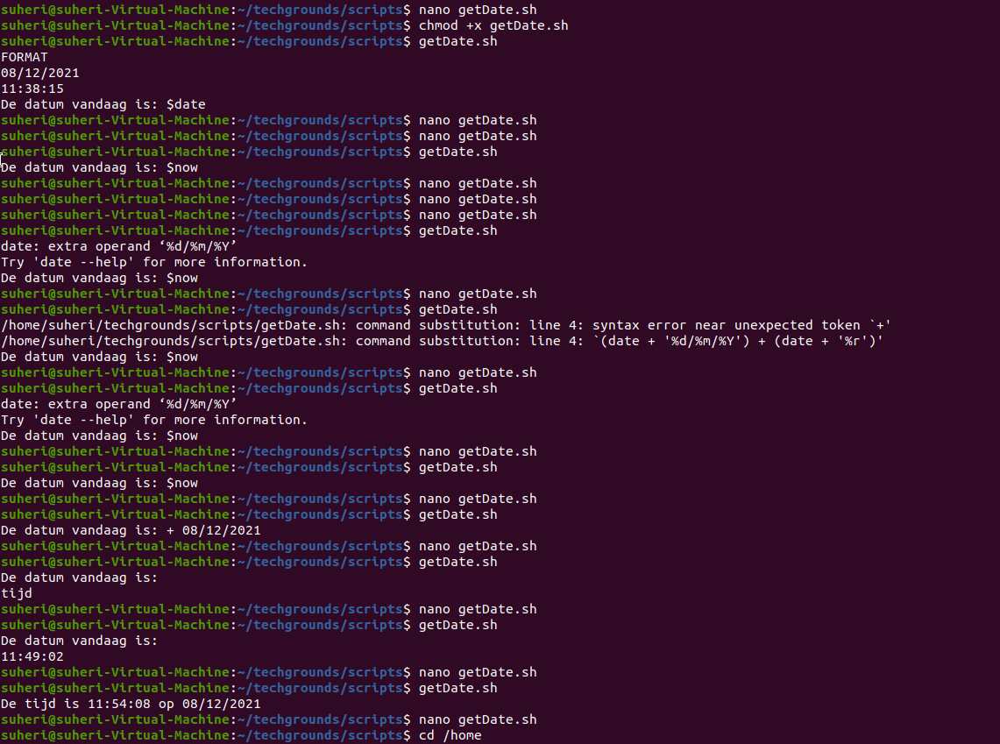
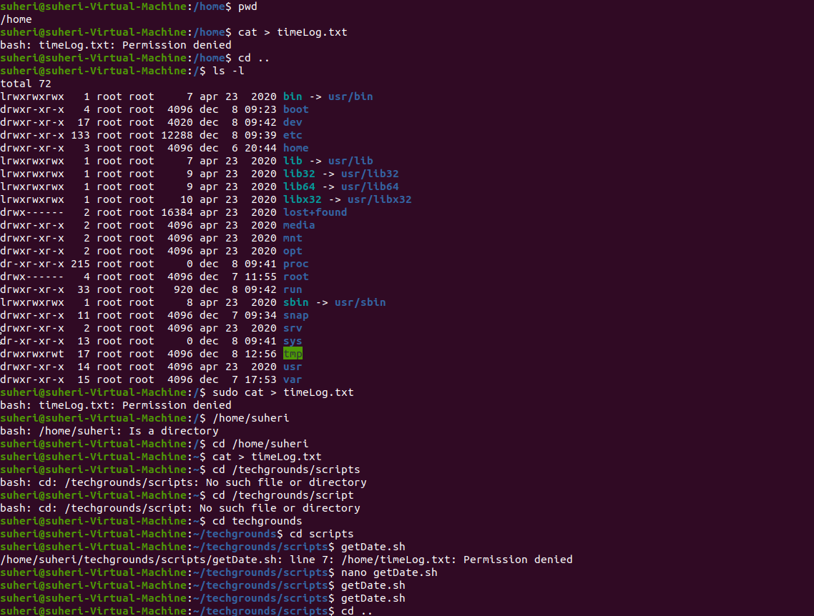
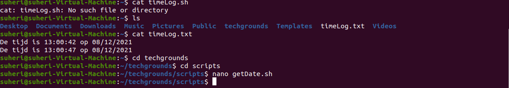
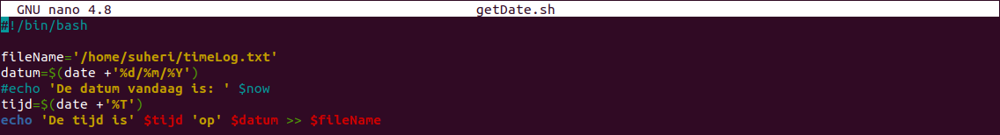
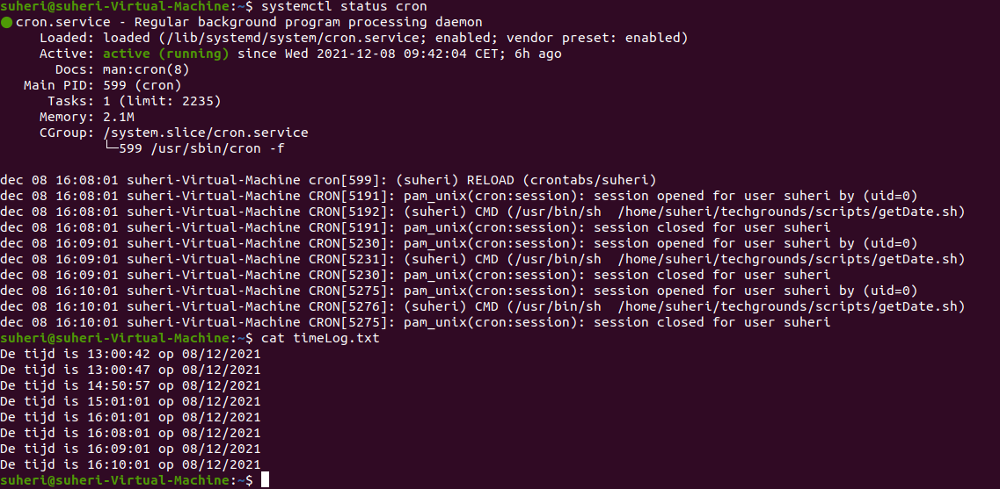
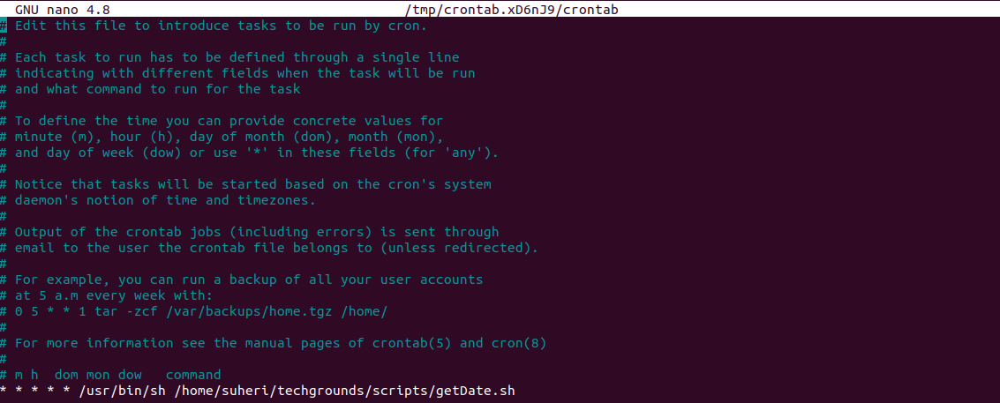
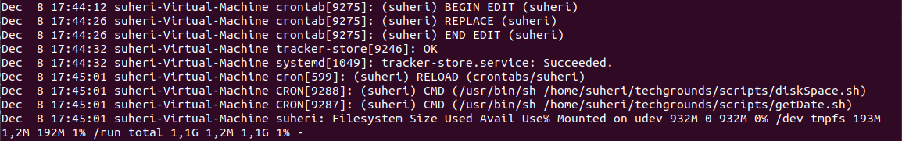
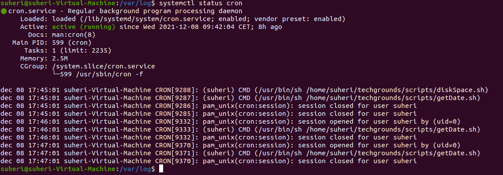
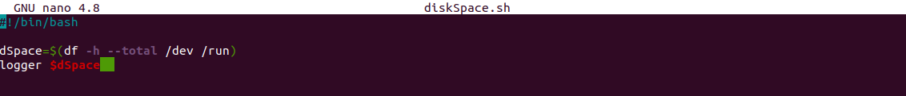

# Cron jobs

Introductie betreft Cron jobs

## Key-terms

- Cron Job

Een Cronjob of crontab is een Unix commando dat een programma of script op een ingesteld tijdstip uitvoert. Cronjobs worden gebruikt in Unix-achtige systemen als Linux, BSD en Apple Macintosh. Het woord 'cron' is afkomstig van het Engelse woord chronograph, dat een soort stopwatch is. Later is hier job (taak) aan toegevoegd. Een cronjob die een systeem service draait wordt een daemon genoemd. Dit zijn meestal servertoepassingen.

Vaak worden Cronjobs gebruikt voor het ophalen van de e-mail, het verzenden van e-mail of het controleren op updates. Als een Cronjob op een (web)server wordt gebruikt, is dat vaak om een back-up van een database te maken, een PHP of perl script aan te roepen of een servercommando uit te voeren. De meeste webhosters bieden cronjobs aan in een control panel zoals Plesk of DirectAdmin.

Cronjobs kunnen worden vergeleken met de taakplanner onder Microsoft Windows en werken exact hetzelfde. Voor wie cronjobs via de terminal lastig in te stellen vindt, zijn er verschillende programma's met een grafische gebruikersomgeving (GUI) waarmee via een paar muisklikken een cronjob aangemaakt kan worden.

- Logbestanden

Logbestanden zijn bestanden die berichten over het systeem bevatten, inclusief de kernel, services en toepassingen die erop worden uitgevoerd. Er zijn verschillende logbestanden voor verschillende informatie.

Logbestanden zijn erg handig wanneer u probeert een probleem met het systeem op te lossen, zoals. Het kan bijvoorbeeld helpen wanneer een gebruiker een kerneldriver probeert te laden of wanneer het zoekt naar ongeautoriseerde inlogpogingen met het systeem. Logfile registreert gebeurtenissen die zich voordoen in een besturingssysteem of andere softwareprogramma's of berichten tussen verschillende gebruikers van een communicatiesoftware. Het is als een spiegel die elke activiteit van het systeem laat zien. Merk ook op dat sommige logbestanden worden bestuurd door een daemon genaamd syslogd. Een lijst van logberichten die door syslogd worden bijgehouden, is te vinden in het /etc/syslog.conf-configuratiebestand

Enkele van de meest voorkomende logbestanden zijn:

Systeemlogboeken

*Autorisatielogboek
*Daemon Log
*Foutopsporingslogboek
*Kernel Log
*Kernel Rig Buffer
*Systeem log
*Applicatielogboeken

*Apache HTTP Server Logs
*CUPS Print System Logs
*Rootkit jagerslogboek
*Samba SMB Server Logs
*X11-serverlogboe

CLI:

    cd /var/log
    ls

## Opdracht 1

- Create a Bash script that writes the current date and time to a file in your home directory.

Terminal

Script

- Register the script in your crontab so that it runs every minute.

Terminal

Crontab

- Create a script that writes available disk space to a log file in ‘/var/logs’. Use a cron job so that it runs weekly.

Output Syslog

Terminal

Script

### Gebruikte bronnen

<https://nl.wikipedia.org/wiki/Cronjob>

<https://www.cyberciti.biz/faq/unix-linux-getting-current-date-in-bash-ksh-shell-script/>

<https://www.shell-tips.com/linux/how-to-format-date-and-time-in-linux-macos-and-bash/>

<https://linuxize.com/post/bash-if-else-statement/>

<https://stackoverflow.com/questions/13982042/random-in-bash-doesnt-work>

<https://www.baeldung.com/linux/random-numbers>

<https://www.howtogeek.com/409611/how-to-view-free-disk-space-and-disk-usage-from-the-linux-terminal/#:~:text=Bash%20contains%20two%20useful%20commands,terminal%20window%20to%20get%20started.>

<https://www.jessicayung.com/automate-running-a-script-using-crontab/>

<https://crontab.guru/#*_*_*_*_*>

<https://ubuntu.com/tutorials/viewing-and-monitoring-log-files#2-log-files-locations>

<https://geek-university.com/linux/create-a-log-entry/>

### Ervaren problemen

Opdracht 2 begon gelukkig eindelijk een beetje obstakel te geven waar ik zeker wat tijd mee kwijt was. Op internet gevonden hoe Cronjobs in te stellen en dat bij errors in de /var/mail of /var/spool/mail een error-message zou staan onder de gebruikersnaam. In eerste instantie werkte de cron niet gezien het script niet werd uitgevoerd. Extra controle script. Werkte correct. Status Cron ook correct. Door verder te zoeken kwam ik uit bij [CronGuru](https://crontab.guru/#*_*_*_*_*) waarbij ik zag dat de waarde die ik had ingevuld (1) betekende dat het elke 1e minuut van elk uur zou worden uitgevoerd. Cronjob gewijzigd en alles correct werkend.

### Resultaat

Zie screenshots bij Opdracht. Heb het naar mijn zin gehad deze week!
