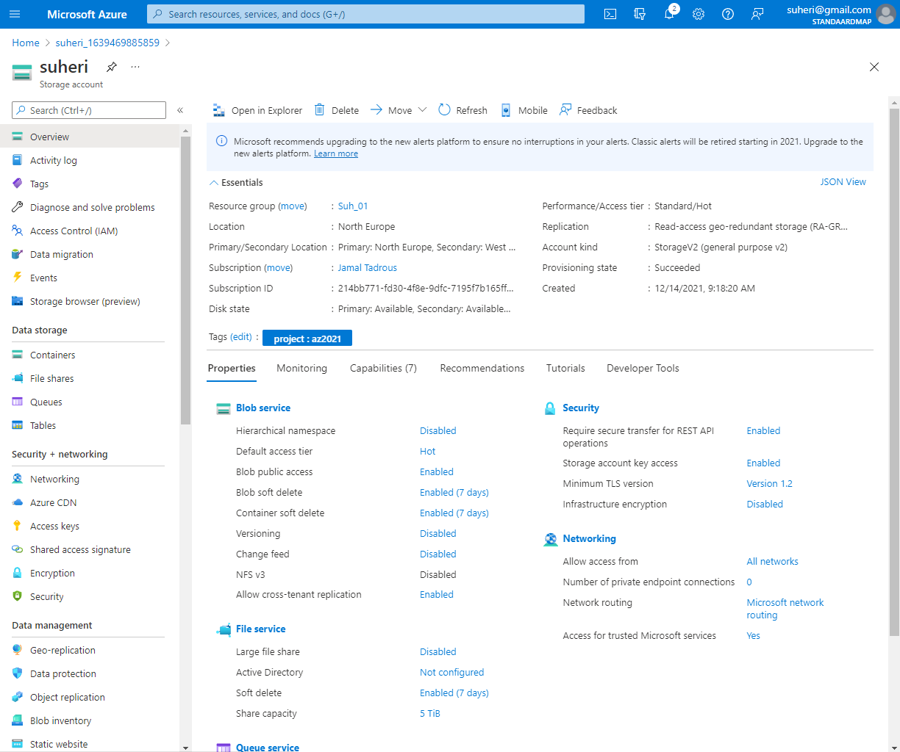

# Azure Storage Account

Om data op te slaan in Azure heb je een Azure Storage Account nodig. In een Storage Account staan alle Azure Storage data objects als blobs, files, disks en tables.

Data in een Storage Account is secure, highly available, durable en massively scalable. Alle data in een Storage Account is bereikbaar via het internet met HTTP en HTTPS. Omdat het makkelijk te bereiken is moet je goed opletten dat alleen de juiste identiteiten permissies hebben om bij de data te komen.

Azure Storage explorer is een gratis GUI om je data te beheren in Azure.

Veel IaaS en PaaS services van Azure maken ook gebruik van Azure Storage Accounts.

## Key-terms

- Blob
    Een BLOB is een - potentieel groot - gegevenselement in een database dat bestaat uit bytes waaraan in de database geen tekencodering of andere interpretatie is verbonden (dit in tegenstelling tot de CLOB). Het woord is gevormd als verwijzing naar het Engelse woord "blob": een vormeloze, onduidelijke substantie, en in het bijzonder zoals gebruikt in de filmklassieker The Blob uit 1958.[1] Later is er de betekenis binary large object) aan gegeven.

    In de praktijk is een BLOB bijvoorbeeld een afbeelding (foto) of een stuk muziek. In feite wordt dan niet het bestand in de database opgenomen maar een verwijzing (pointer) naar dat bestand. Voor de gebruiker is dan de BLOB opgenomen in de database.

    Een BLOB is het database-equivalent van een binair bestand. Opslaan in een database heeft voor- en nadelen ten opzichte van opslaan in het bestandssysteem.

- IaaS
    Internet as a Service

- PaaS
    Platform as a Service

## Opdracht

Maak een Azure Storage Account. Zorg dat alleen jij toegang hebt tot de data.

Plaats data in een storage service naar keuze via de console (bijvoorbeeld een kattenfoto in Blob storage).

Haal de data op naar je eigen computer door middel van de Azure Storage Explorer.

### Gebruikte bronnen

<https://nl.wikipedia.org/wiki/BLOB_(informatica)>

### Ervaren problemen

Geen

### Resultaat