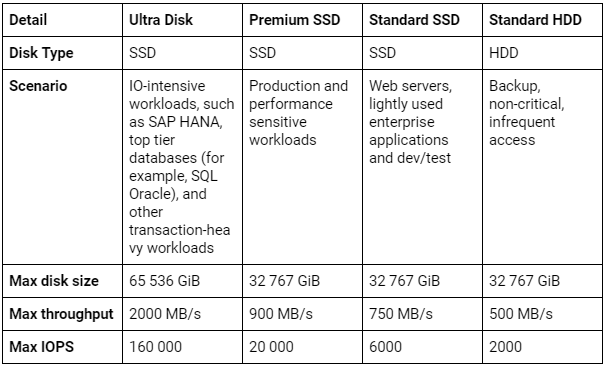
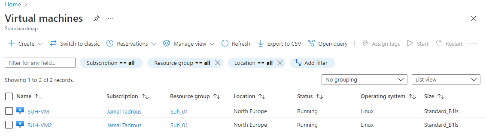
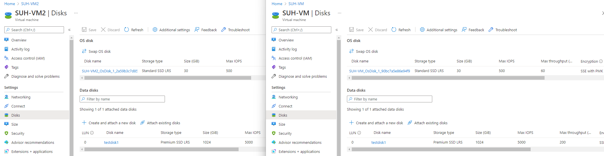
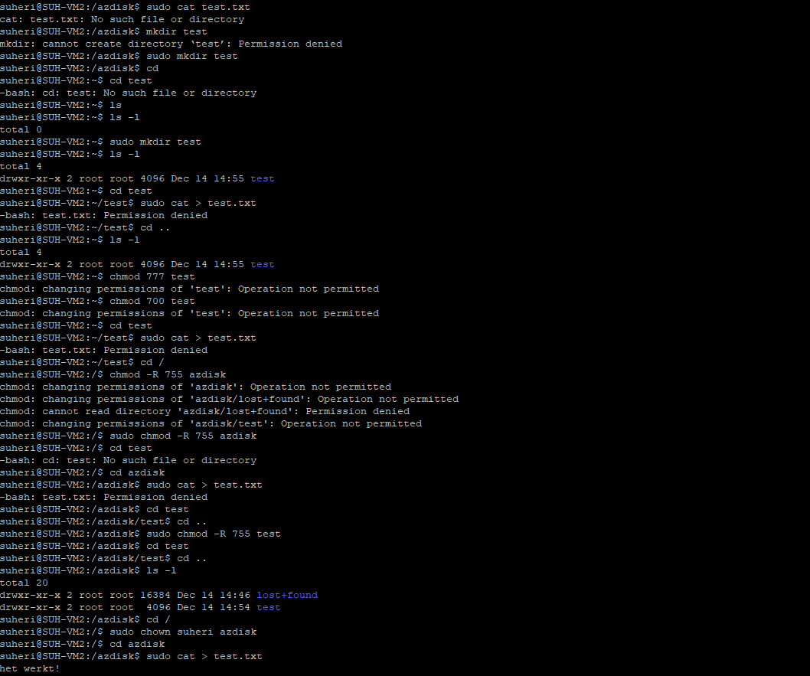
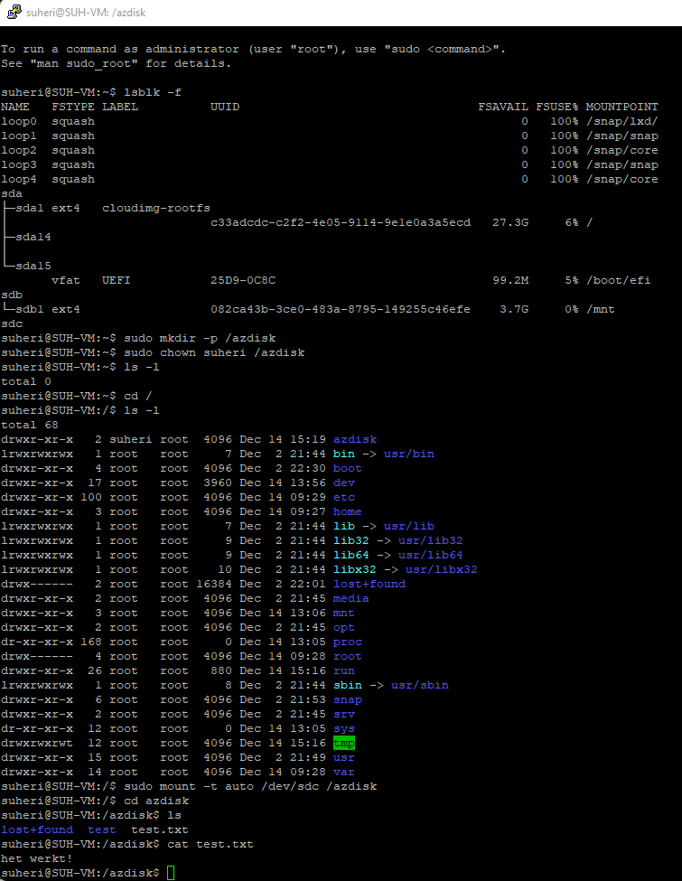
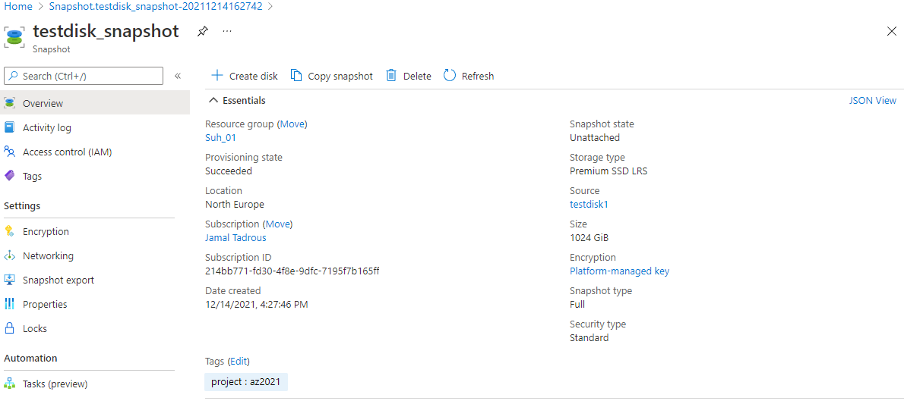
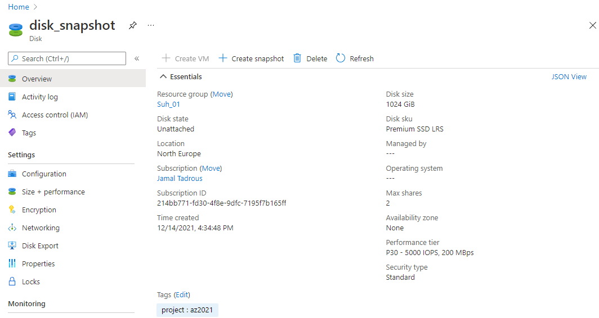
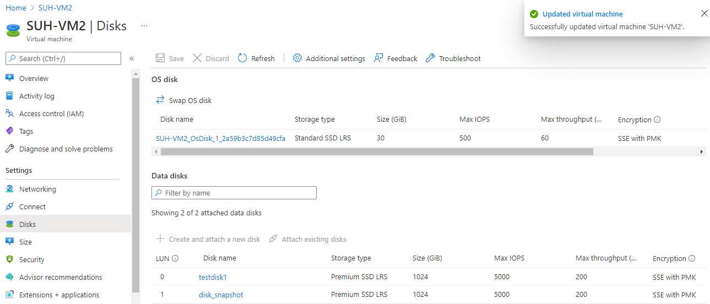
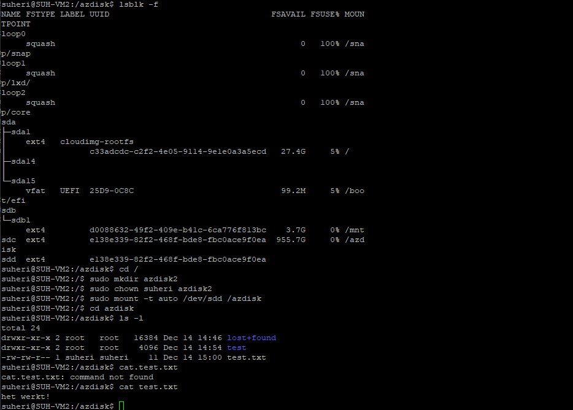

# Azure Disk Storage

Azure Disk Storage kan gezien worden als een virtual hard drive in de cloud. Een disk kan een OS disk (waar het OS op staat) of een Data Disk (te vergelijken met een externe harde schijf) zijn. Je hebt een keuze tussen Managed Disks en Unmanaged Disks. Unmanaged Disks zijn goedkoper, maar je hebt er wel een Storage Account nodig (en je moet de disk dus zelf managen). Managed Data Disks kunnen gedeeld worden tussen meerdere VMs, maar dat is een relatief nieuwe feature en er zitten wat haken en ogen aan.

Backups van een Managed Disk kan je maken met Incremental Snapshots die alleen de aanpassingen sinds de laatste snapshot opslaan. Voor een Unmanaged Disk kan je alleen een ‘normale’ snapshot maken.

Er zijn 4 typen managed disks. Over het algemeen kan je zeggen dat meer performance zorgt voor hogere kosten:
bron: https://docs.microsoft.com/en-us/azure/virtual-machines/disks-types

## Key-terms

Determine Drive Information

        sudo lshw -C disk

To determine the path that your system has assigned to the new hard drive, open a terminal and run.

## Opdracht

### Gebruikte bronnen

<https://unix.stackexchange.com/questions/264434/mount-doesnt-give-write-permission-to-user>

<https://phoenixnap.com/kb/linux-format-disk>

<https://docs.microsoft.com/nl-nl/azure/virtual-machines/linux/attach-disk-portal>

### Ervaren problemen

Geen

### Resultaat

Start 2 Linux VMs. Zorgt dat je voor beide toegang hebt via SSH

Maak een Azure Managed Disk aan en koppel deze aan beide VMs tegelijk.

Creëer op je eerste machine een bestand en plaats deze op de Shared Disk.

Kijk op de tweede machine of je het bestand kan lezen.

Maak een snapshot van de schijf en probeer hier een nieuwe Disk mee te maken

Mount deze nieuwe Disk en bekijk het bestand. 
