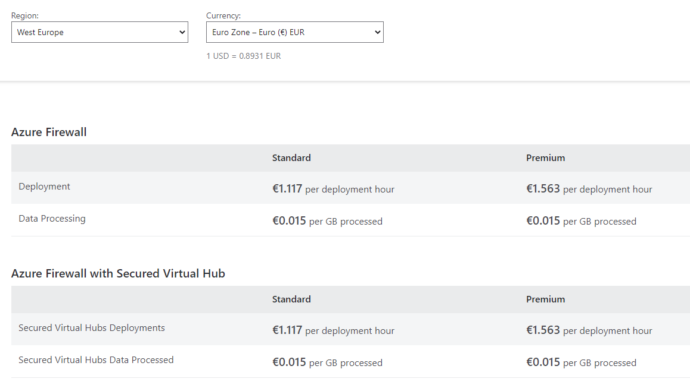
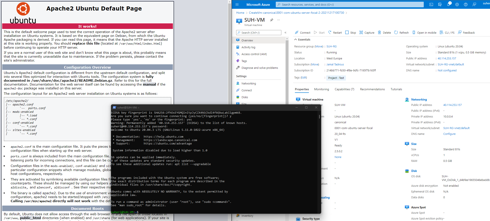
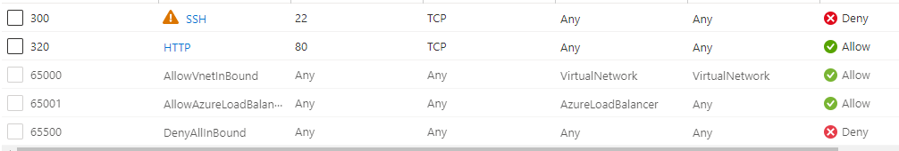
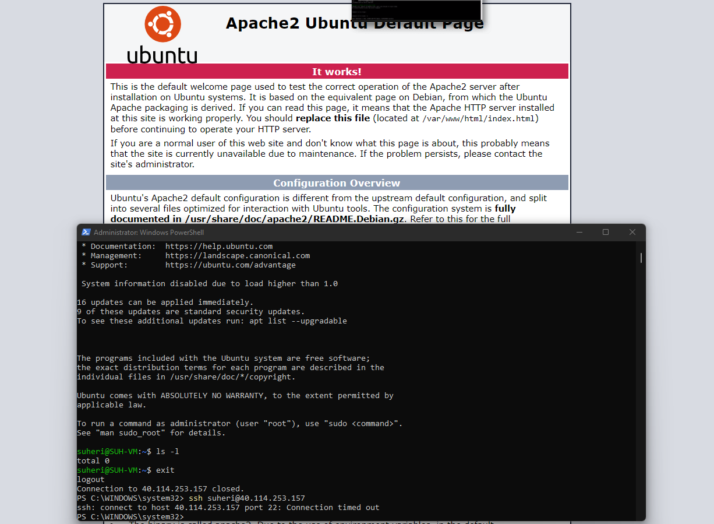

# **Azure Firewall**

Sinds alle bronnen in de cloud altijd online staan, is het belangrijk om deze te beveiligen tegen bedoeld en onbedoeld schadelijk verkeer. Azure Firewalls kunnen VNets beschermen tegen dit verkeer.

Je kan de Firewall in verschillende configuraties gebruiken in een subnet, of in een hub-and-spoke network. Een Firewall heeft altijd een publiek IP adres waar al het inkomend verkeer naartoe gestuurd dient te worden. En een privé IP adres waar al het uitgaande verkeer naartoe moet.

Zoals je eerder geleerd hebt zijn er twee soorten firewalls: stateless, en stateful. Azure Firewall is een stateful firewall. 

## **Key-terms**

- **NSG**
    
    - Network Security Group

- **RBAC**
    
    - Roll Based Access Control

- **Statefull/Stateless**
    
    - Stateful firewalls filteren pakketten op basis van de volledige context van een bepaalde netwerkverbinding.
    Stateless firewalls filteren pakketten op basis van de individuele pakketten zelf.

- **Het verschil tussen Basic en Premium Firewall**

    - **Azure Firewall (Basic)**

        

        Dit is een cloudgebaseerde netwerkbeveiligingsservice om de virtuele Azure-netwerkbronnen te beveiligen. Om bronnen te beschermen, gebruikt het een statisch openbaar IP-adres voor virtuele netwerkbronnen, zodat externe firewalls gemakkelijk het verkeer kunnen identificeren dat afkomstig is van dat specifieke virtuele netwerk.

        - Hoge beschikbaarheid
        - Beschikbaarheidszones
        - Filterregels voor netwerkverkeer
        - FQDN-tags (*Fully Qualified Domain Name - bijv. bol.com*)
        - Servicetags
        - Onbeperkte schaling
        - FQDN-filterregels
        - Bedreigingsinformatie
        - Meerdere openbare IP-adressen
        - Logboekregistratie van Azure Monitor
        - Geforceerde tunneling
        - Uitgaande SNAT-ondersteuning
        - Inkomende DNAT-ondersteuning
        - Webcategorieën (preview)
        - Certificeringen

       

    -  **Azure Firewall (Premium)**

        
 
        - Transport Layer Security Inspection
        
         De premiumversie van Azure Firewall decodeert uitgaand verkeer, voert de noodzakelijke beveiligingsfuncties uit en versleutelt het verkeer dat naar de oorspronkelijke bestemming wordt verzonden opnieuw.

        - Intrusion Detection & Prevention System (IDPS)
        
        De premium firewall biedt op handtekeningen gebaseerde IDPS voor het detecteren van aanvallen door het observeren van specifieke patronen of bekende kwaadaardige instructies die door malware worden gebruikt, zoals byte-sequenties in netwerkverkeer.

        - Webcategorieën
        
        Beheerders kunnen gebruikerstoegang tot de op internet gebaseerde categorieën toestaan/weigeren om de tijd die wordt besteed aan het beheer van individuele volledig gekwalificeerde domeinnamen (FQDN's) en URL's te minimaliseren. Azure Firewall Standard bevat webcategorieën, maar is nauwkeuriger afgestemd in Azure Firewall Premium-preview.

        - URL-filtering
        
        Het geeft gebruikers toegang tot specifieke URL's voor zowel versleuteld verkeer als platte tekst, vooral wanneer het wordt gebruikt bij congestie met de webcategorieën. Het beperkt ook de toegang tot webinhoud met behulp van ingebouwde URL-filtering en verbetert de mogelijkheden voor inhoudsfiltering met behulp van de functie webcategorieën.

    - [**Prijs**](https://azure.microsoft.com/nl-nl/pricing/details/azure-firewall)

        

- **Het verschil tussen een Firewall en een Firewall-beleid (Firewall Policy)**

    - Een [firewall-beleid](https://docs.microsoft.com/en-us/azure/firewall/central-management#firewall-policy) is een Azure-resource die NAT-, netwerk-en toepassings regel verzamelingen en instellingen voor bedreigings informatie bevat. Het is een wereld wijde resource die kan worden gebruikt voor meerdere Azure Firewall instances in beveiligde virtuele hubs en hub virtuele netwerken. Beleid kan helemaal nieuw worden gemaakt of worden overgenomen van bestaand beleid. '*Inheritance*' stelt DevOps in staat om lokaal firewall-beleid te maken boven op het basisbeleid dat verplicht is in de organisatie. Beleidsregels werken in verschillende regio’s en abonnementen.

## **Opdracht**

- Zet een webserver aan. Zorg dat de poorten voor zowel SSH als HTTP geopend zijn.
- Maak een Azure Firewall in VNET. Zorg ervoor dat je webserver nog steeds bereikbaar is via HTTP, maar dat SSH geblokkeerd wordt.

### **Gebruikte bronnen**

*<https://docs.microsoft.com/nl-nl/azure/firewall/tutorial-firewall-deploy-portal>*

*<https://docs.microsoft.com/nl-nl/azure/virtual-network/virtual-networks-overview>*

*<https://peoplactive.com/azure-firewall-premium-protect-your-network-resources>*

*<https://azure.microsoft.com/en-in/pricing/details/azure-firewall>*

*<https://docs.microsoft.com/nl-nl/azure/firewall-manager/policy-overview>*

*<https://docs.microsoft.com/nl-nl/azure/firewall/central-management>*

### **Ervaren problemen**

- De verwoording van de opdracht was neit helemaal correct wat ik al dacht. Gezien er eerst een VM moest worden aangemaakt en daara de netwerk-rules aan te passen (wat wordt aangemaakt via NSG (Network Security Group)) om daar dan een Azure Firewall aan te koppelen was niet makkelijk. De firewall heeft een specifiek subnet nodig om te werken. Ik heb verschillende set-up's geprobeerd maar de Azure Firewall bleef ook de http-poort blokkeren wanneer ik de SSH-poort blokkeerde. Even gekeken naar de opdracht van de AWS collega's waarbij zij alleen de Security Groups moesten onderzoeken. Een Azure Firewall opzetten is een stuk geavanceerder gezien het netwerk vrij precies op moet worden gezet. Dit is wel een ding wat ik zelf verder ga onderzoeken. Security vind ik erg interessant en ga er nog mee aan de slag waarom het niet lukte met de LINUX-VM.

### **Resultaat**

- Zet een webserver aan. Zorg dat de poorten voor zowel SSH als HTTP geopend zijn.

- Maak een Azure Firewall in VNET. Zorg ervoor dat je webserver nog steeds bereikbaar is via HTTP, maar dat SSH geblokkeerd wordt.

