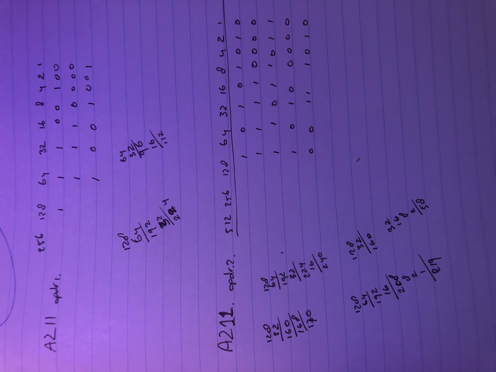

# **Tellen in Binair**

- Het binaire of tweetallige talstelsel is een positiestelsel, waarin een getal wordt voorgesteld door een rijtje van de cijfers 1 en 0. Een dergelijk cijfer wordt in deze context een bit ("binary digit") genoemd.

- Een binaire variabele is een variabele die twee elkaar uitsluitende waarden kan aannemen, zoals 1 of 0, + of −, Ja of Nee, Waar of Onwaar, Aan of Uit.

- Het binaire talstelsel is een positiestelsel, waarin iedere positie overeenkomt met een macht van 2. Bijvoorbeeld het getal 0101 in het binaire talstelsel representeert het getal 5 (1 + 0 + 4 + 0) in het decimale stelsel.

## **Key-terms**
 
*NVT*

## **Opdracht**
 
- Vertaal de decimalen in binair:

| **Decimaal** | **Binair** |
| :--------:| :----: |
| 16  | **10000** |
| 128 | **10000000** |
| 228 |  **11100100**
| 112 | **1110000**
| 73 | **1001001**

 
- Vertaal de volgende bytes in decimalen:

| **Binair** | **Decimaal** |
| :-: | :-: |
| 1010 1010 | **170** |
| 1111 0000 | **240** |
| 1101 1011 | **219** |
| 1010 0000 | **160** |
| 0011 1010 | **58** |

### **Gebruikte bronnen**
 

*<https://nl.wikipedia.org/wiki/Binair>*
*<https://nl.wikihow.com/Binair-tellen>*

### **Ervaren problemen**

*Geen*
 

### **Resultaat**
 

Mijn handmatige berekeningen:

