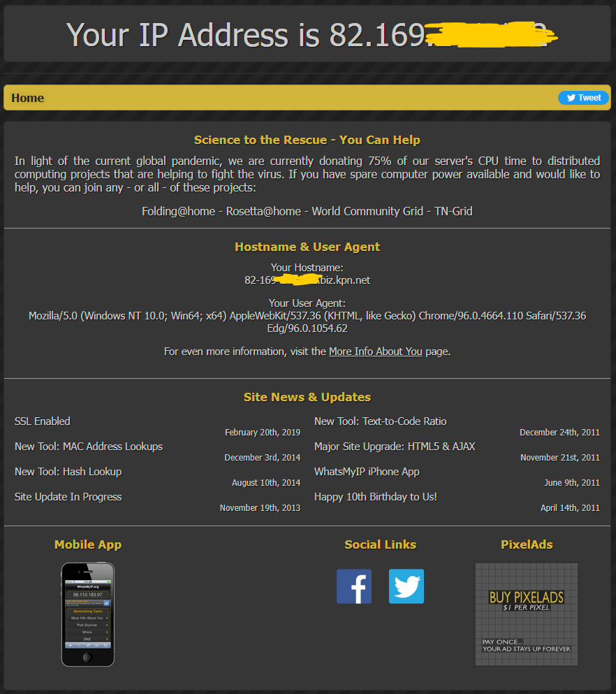
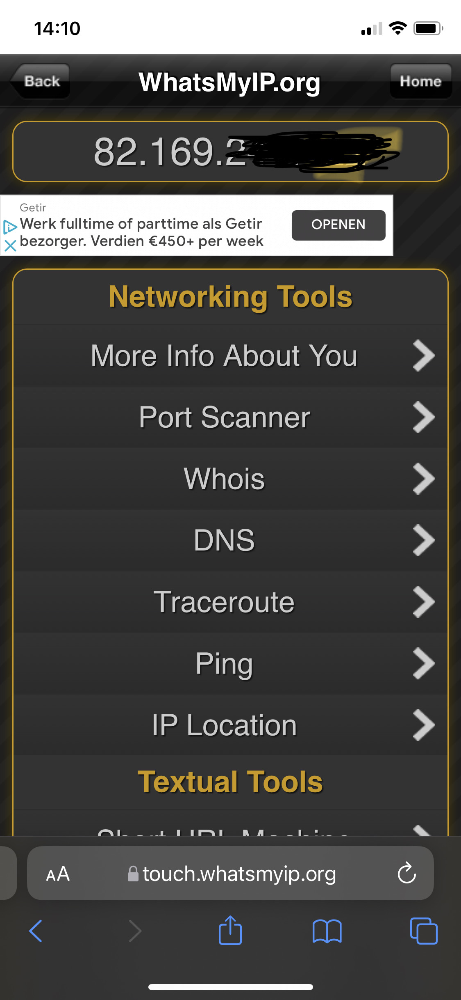
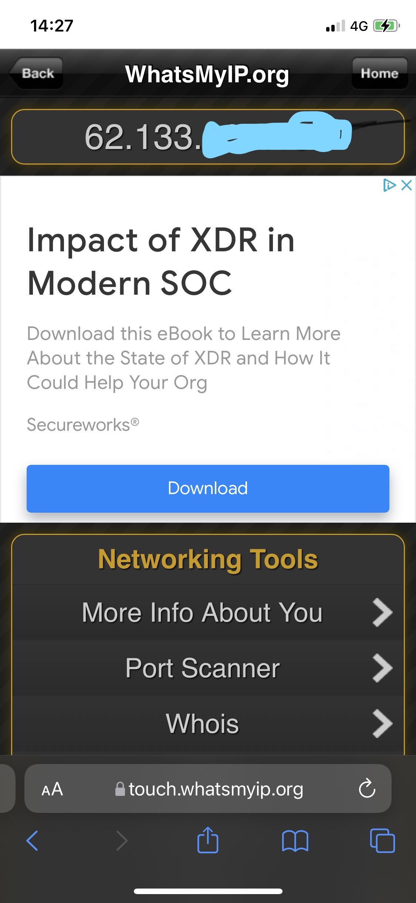
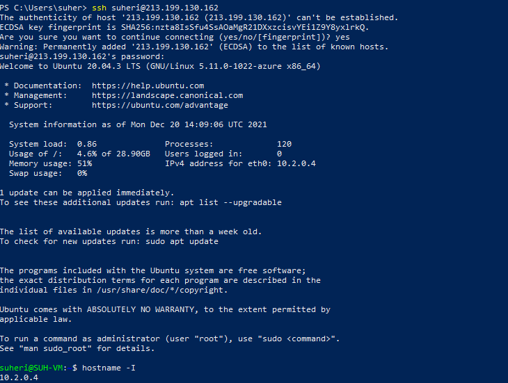
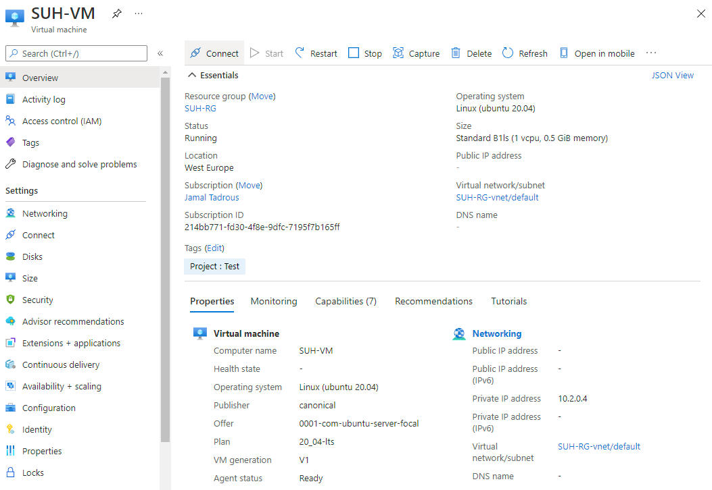

# **IP adressen**
 

Een IP adres is een logisch adres die aan een netwerkapparaat toegewezen kan worden. De netwerkapparaten kunnen dan vervolgens met dit IP adres elkaar vinden op het netwerk.
Een IPv4 adres heeft 32 bits (8 bytes), en is meestal geschreven in decimalen (bijvoorbeeld: 132.88.142.5) waar iedere blok voor, na, en tussen de punten, 1 byte is. Dit betekent dat één blok tussen punten een maximale waarde kan hebben van 255. 

## **Key-terms**
 

- **IP adressen**

    Een IP-adres, waarin IP staat voor Internet Protocol, is in een computernetwerk een adres waarmee een NIC (network interface card of controller), of in het Nederlands 'netwerkkaart', van een host in het netwerk eenduidig geadresseerd kan worden binnen het TCP/IP-model, de standaard van "het" internet.

- **IPv4**

     IPv4 is een IP-adres een reeks van 32 bits. De adresruimte van IPv4 bevat daarom maximaal 232 = 4.294.967.296 IP-adressen. Dat is minder dan er mensen op aarde zijn. In werkelijkheid is het beschikbare aantal adressen minder, want in de praktijk worden bepaalde adressen als broadcastadres of netwerkadres gebruikt en is een deel van de adresruimte als privé-adresruimte voor bijvoorbeeld testdoeleinden gereserveerd, zoals beschreven staat in RFC 1918. Dit deel wordt niet over het internet gerouteerd. Verder zijn hele reeksen IP-adressen toegekend aan bedrijven en providers, bijvoorbeeld een reeks van 65.536 adressen, terwijl dat bedrijf niet zo veel adressen nodig heeft.

    Het is gebruikelijk een IP-adres uit IPv4 op te delen in vier groepen van 8 bits en deze weer te geven in de vorm van door punten gescheiden decimale getallen, bijvoorbeeld 192.0.2.197. Dit is korter dan de 32 bits en eenvoudiger te lezen. Elk van de vier getallen ligt tussen 0 en 255, beide inbegrepen. Voor de mens zijn zulke combinaties van vier getallen echter ook nog moeilijk te onthouden. Daarom wordt het Domain Name System (DNS) gebruikt om IP-adressen in leesbare en makkelijker te onthouden namen, zoals nl.wikipedia.org, om te zetten en vice versa.

    In principe bestaat een IP-adres in IPv4 uit een netwerkgedeelte, gevolgd door een hostgedeelte. Het netwerkgedeelte geeft aan welk netwerk bedoeld is en het hostgedeelte geeft de host (bv. een pc of een router) aan binnen het netwerk.

- **IPv6**

    Een structurele oplossing voor de schaarste in adresruimte van IPv4 is te vinden in de opvolger hiervan: IPv6. In IPv6 zijn er 128 bits beschikbaar voor een IP-adres, en is de theoretische bovengrens dus 2128 ≈ 3,4 ×1038 IP-adressen. Net als bij IPv4 geldt dat in de praktijk weer adressen gebruikt worden als netwerkadres en broadcastadres, maar evengoed is het aantal toe te kennen IP-adressen hiermee enorm groot: triljarden adressen per persoon.

- **Public en Private IPs**

    - **0.0.0.0**
    
    "Deze host op dit netwerk", mag standaard niet verzonden worden, behalve als bronadres in een procedure waarbij een host het eigen IP-adres leert.

    - **127.0.0.1**

    Het meest gebruikte adres voor localhost, maar andere adressen binnen 127.0.0.0/8 kunnen er ook voor gebruikt worden.

    - **10.0.0.0/8, 172.16.0.0/12 en 192.168.0.0/16**

    De volgens RFC 1918 voor privé-netwerken gereserveerde reeksen van IP-adressen.

    - **192.0.2.0/24, 198.51.100.0/24 en 203.0.113.0/24**

    Deze blokken zijn volgens RFC 5737 gereserveerd voor gebruik in documentatie.

- **NAT**

    Onder andere om aan de schaarste aan adresruimte binnen IPv4 tegemoet te komen, is network address translation (NAT), ook wel IP-masquerading genoemd, ontwikkeld. Hiermee kunnen de hosts van een intranet met IP-adressen uit de privé-adresruimte van RFC 1918 worden geadresseerd, terwijl de NAT-router dit naar buiten toe presenteert als één enkel IP-adres van de routeerbare adresruimte, dus slechts één IP-adres hoeft werkelijk gerouteerd en toegekend te worden, terwijl honderden hosts hier gebruik van kunnen maken. Men kan dit vergelijken met het systeem van een interne telefooncentrale. Er is slechts één buitenlijn (één IP-adres) maar vele gebruikers die via die telefooncentrale verbonden zijn met de buitenwereld. Voor alle andere gebruikers op het internet is er maar één IP-adres zichtbaar. Een groot nadeel van NAT is dat standaard alleen uitgaande verbindingen mogelijk zijn. Het mogelijk maken van binnenkomende verbindingen vergt specifieke oplossingen, die niet altijd even goed werken.
   

## **Opdracht**
 

- Ontdek wat je publieke IP adres is van je laptop en mobiel op wifi
- Ontdek wat je publieke IP adres is op je mobiel via mobiel internet (als mogelijk)
- Maak een VM in je cloud met een publiek IP. Maak verbinding met deze VM.
- Verwijder het publieke IP adres van je VM. Begrijp wat er gebeurt met je verbinding.

### **Gebruikte bronnen**

*<https://nl.wikipedia.org/wiki/IP-adres>*

### **Ervaren problemen**

*Geen*

### **Resultaat**

- *Ontdek wat je publieke IP adres is van je laptop en mobiel op wifi*

- *Ontdek wat je publieke IP adres is op je mobiel via mobiel internet (als mogelijk)*

- *Maak een VM in je cloud met een publiek IP. Maak verbinding met deze VM.*

- *Verwijder het publieke IP adres van je VM. Begrijp wat er gebeurt met je verbinding.*

Die valt uiteraard weg aangezien we met SSH zijn verbonden met het publieke ip. Timeout dus in je gekozen CLI.

