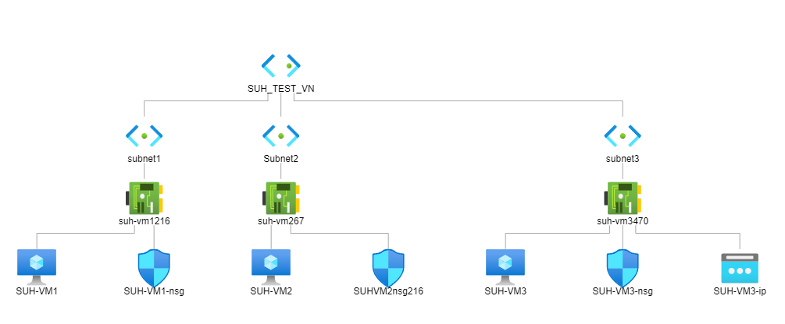
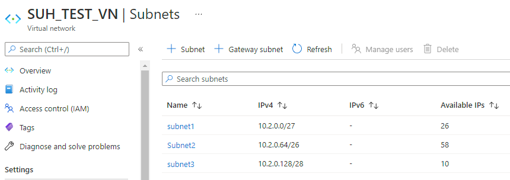
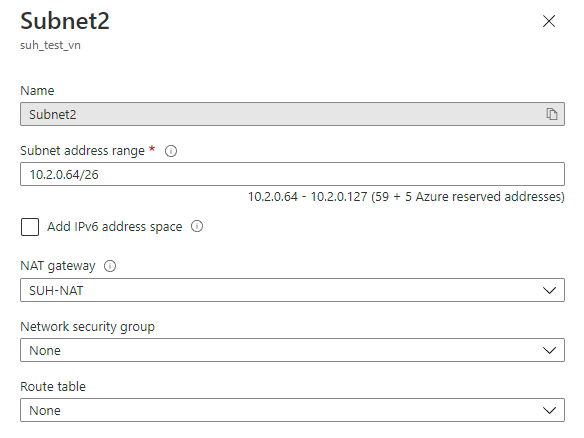
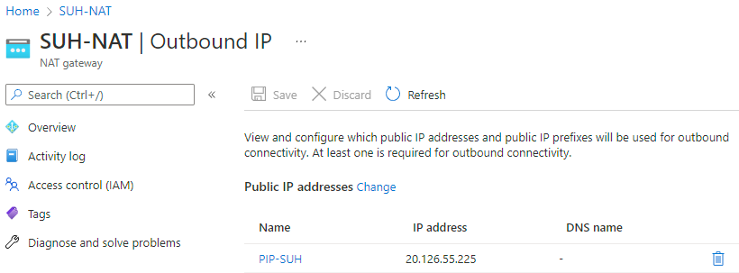
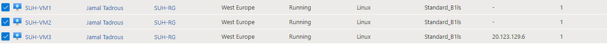

# **Subnetting**

Een netwerk is gedefinieerd als twee of meer devices die met elkaar verbonden zijn zodat ze data kunnen uitwisselen. Een Local Area Network (LAN) wordt vaak uitgedrukt als een range aan IP addresses. Elk device (host) krijgt een eigen adres binnen die range.

Om dit te ondersteunen hebben netwerken een subnet mask (prefix) die definieert hoeveel bits van het IP adres onderdeel uitmaken van het netwerkadres, en hoeveel bits gereserveerd zijn voor de host.

Een subnet is een kleiner netwerk dat onderdeel is van een groter netwerk. Subnets kunnen worden gebruikt om een deel van het netwerk logisch te isoleren. Een subnet heeft per definitie een grotere prefix dan het netwerk waar het subnet in zit.

Om dit alles leesbaar te maken voor mensen maken we gebruik van CIDR notation.

## **Key-terms**

- **CIDR notatie**

    Classless Inter-Domain routing (CIDR) is een methode voor het aanduiden van IP-adressen. CIDR werd in 1993 geïntroduceerd als vervanger voor de vroegere adressering op basis van klassen (A/B/C), met als doel de snelle groei van de routingtabellen tegen te houden en het probleem van de beperkte IP-adresruimte aan te pakken.

    Het belangrijkste verschil met adressering op basis van klassen, is dat bij CIDR exact (op bit-niveau) wordt aangeduid welke bits van een 32-bit IPv4-adres tot het netwerkgedeelte behoren en welke gebruikt worden om de hosts in dat netwerk aan te duiden. De CIDR notatie is dezelfde als bij een IPv4-adres, maar met een "/" (slash) erachter, gevolgd door een decimaal getal tussen 0 en 32 dat het aantal significante bits aanduidt.

- **Netmasker**

    Een netwerkmasker, subnetmask of ook wel netmask is een binair getal dat wordt gebruikt om een scheiding, ofwel subnet aan te brengen in de IP-adressering. De IP-adressen binnen dit subnet vallen binnen hetzelfde broadcast-domain. Dit heeft tot gevolg dat een broadcast niet over het gehele internet wordt verzonden.

    Het 'netmask' bestaat binair geschreven uit een aantal (zeg {\displaystyle n}n) opeenvolgende "énen" vanaf het MSB (Most Significant Bit) van een 32-bits IP-adres (8 bits maal 4), gevolgd door {\displaystyle 32-n}{\displaystyle 32-n} "nullen". Voor de bij dit netmask behorende IP-adressen geldt dat de eerste {\displaystyle n}n bits het (sub-)netnummer zijn, en de opvolgende {\displaystyle 32-n}{\displaystyle 32-n} bits het hostadres.

## **Opdracht**

- Maak een netwerkarchitectuur die voldoet aan de volgende eisen:

    - 1 private subnet dat alleen van binnen het LAN bereikbaar is. Dit subnet moet minimaal 15 hosts kunnen plaatsen.
    - 1 private subnet dat internet toegang heeft via een NAT gateway. Dit subnet moet minimaal 30 hosts kunnen plaatsen (de 30 hosts is exclusief de NAT gateway).
    - 1 public subnet met een internet gateway. Dit subnet moet minimaal 5 hosts kunnen plaatsen (de 5 hosts is exclusief de internet gateway).

- Plaats de architectuur die je hebt gemaakt inclusief een korte uitleg in de Github repository die je met de learning coach hebt gedeeld.

### **Gebruikte bronnen**

*<https://nl.wikipedia.org/wiki/Classless_Inter-Domain_Routing>*

*<https://nl.wikipedia.org/wiki/Netmask>*

*<>*

### **Ervaren problemen**

*Geen*

### **Resultaat**

Ik dacht in plaats van een schema het gelijk in de praktijk te brengen middels de Azure portal :)
Tot nu toe alles goed geconfigureerd behalve dat ik de NAT gateway beter moet instellen zodat subnet 2 toegang heeft tot internet. Dit zal ik later verder uit gaan zoeken. 

