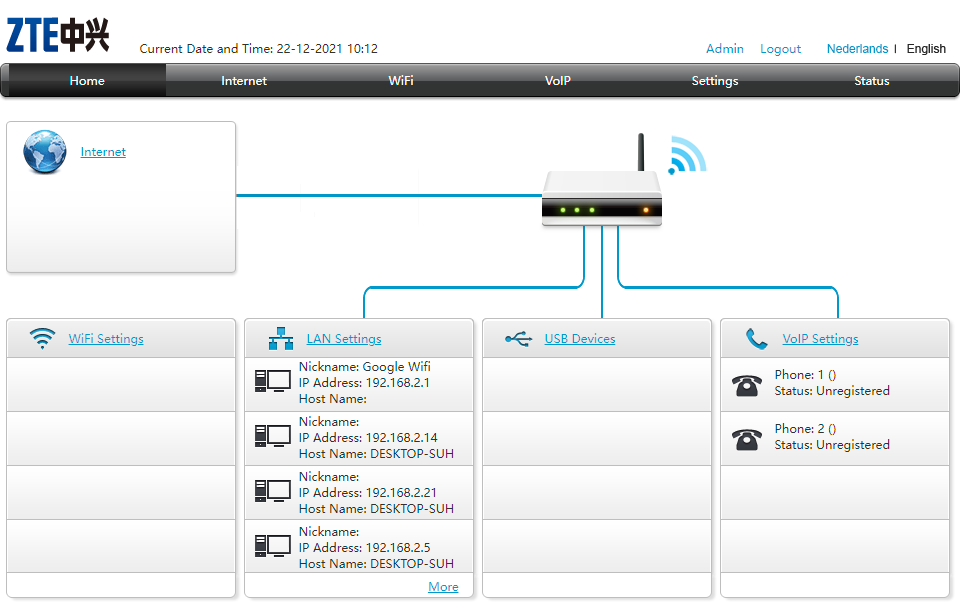
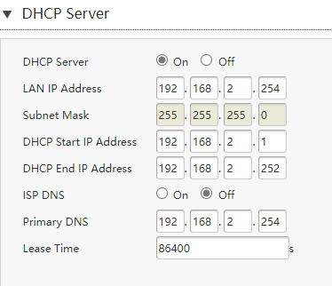
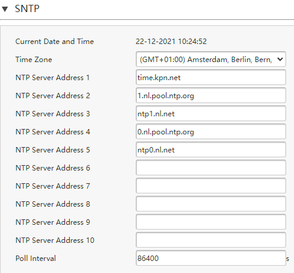

# **Netwerkapparatuur**

## **Key-terms**

## **Opdracht**

- Benoem en beschrijf de functies van veel voorkomend netwerkapparatuur
- Meeste routers hebben een overzicht van alle verbonden apparaten, vindt deze lijst. Welke andere informatie heeft de router over aangesloten apparatuur?
- De standaard instellingen
- Waar staat je DHCP server op jouw netwerk? Wat zijn de configuraties hiervan?
- Bekijk wat netwerkapparatuur voor bedrijven meer kunnen doen.

### **Gebruikte bronnen**

*<https://nl.wikipedia.org/wiki/Router>*

*<https://nl.wikipedia.org/wiki/Switch_(hardware)>*

*<https://nl.wikipedia.org/wiki/Repeater>*

*<https://www.linksys.com/nl/r/wat-is-een-modem/what-is-a-wifi-access-point>*

*<https://nl.wikipedia.org/wiki/Wide_area_network>*

*<https://nl.wikipedia.org/wiki/Virtueel_Particulier_Netwerk>*

*<https://nl.wikipedia.org/wiki/Firewall>*

*<https://nl.wikipedia.org/wiki/Personal_area_network>*

### **Ervaren problemen**

*Geen*

### **Resultaat**

- *Benoem en beschrijf de functies van veel voorkomend netwerkapparatuur*
  
    - **router**
        
        - Een router (uitspraak: Brits: roeter, Amerikaans: rauter) is een apparaat dat twee of meer verschillende computernetwerken aan elkaar verbindt, bijvoorbeeld internet en een bedrijfsnetwerk, en pakketten data van het ene naar het andere netwerk verzendt. Een router kan gezien worden als een schakelapparaat voor datapakketten dat actief is op OSI-laag 3. Dit in tegenstelling tot een hub, die op laag 1 werkt en een switch, die opereert op OSI-laag 2. Een router wordt beschouwd als een uitvoerapparaat.

    - **switch**

        - Een switch is een apparaat in de infrastructuur van pakketgeschakelde computernetwerken dat tot doel heeft toestellen met elkaar te verbinden door het ontvangen, verwerken en doorzenden van ontvangen frames. Een switch kan Ethernet, Token ring, Fibre Channel of andere typen pakketgeschakelde netwerksegmenten verbinden tot één homogeen netwerk op het niveau van de OSI-datalinklaag. Door werkzaam te zijn op laag 2 kan elke switch bijkomende intelligentie toepassen ten opzichte van een hub om tot een beter presterend netwerk te komen. Er bestaan eenvoudige onbeheerde switches, maar ook geavanceerde beheerde switches, waarop men instellingen heeft voor Shortest Path Bridging, VLAN's en QoS, of zelfs mogelijkheden die zich uitstrekken naar hogere lagen, door pakketinspectie.

    - **repeaters**
    
        - Een repeater is een zend-ontvanginstallatie die een signaal ontvangt en op een andere frequentie, signaalniveau en/of hoger vermogen realtime weer uitzendt. Het doel is een groter bereik te verkrijgen en zo communicatie over grotere afstanden mogelijk te maken.

    - **access point** 

        - Een access point is een apparaat dat een draadloos lokaal netwerk of WLAN creëert, doorgaans in een kantoor of groot gebouw. Een accesspoint maakt via een Ethernet-kabel verbinding met een bedrade router, switch of hub en stuurt een Wi-Fi-signaal naar een bepaald gebied. Als u bijvoorbeeld Wi-Fi-toegang wilt bieden bij de receptie van uw bedrijf, maar het signaal van de router bereikt deze plek niet, dan kunt u hier een accesspoint installeren en deze met een Ethernet-kabel aansluiten op de router in de serverruimte, bijvoorbeeld door een kabel door het plafond naar boven te trekken.

- *Meeste routers hebben een overzicht van alle verbonden apparaten, vindt deze lijst. Welke andere informatie heeft de router over aangesloten apparatuur?*

    

    - Mac-adres, status, hoeveelheid verkeer, routing, ip adres, poort, lease-tijd, uplink-status.

- *De standaard instellingen*

    

    

    UPNP aan, DMZ uit, Fixed IP by DHCP-binding aan voor ons aparte Google Wifi. Wij hebben hier 3 verschillende wifi netwerken. 1 voor alle smart-apparatuur op 2.4ghz, 1 voor tablets, telefoons en laptops op 5ghz en een backup wifi-signaal voor in de tuin en wireless access tot router.

- *Waar staat je DHCP server op jouw netwerk? Wat zijn de configuraties hiervan?*

    

- *Bekijk wat netwerkapparatuur voor bedrijven meer kunnen doen.*

    - **Managed Firewall**

    Een managed firewall (een beheerde firewall) wordt steeds vaker toegepast in bedrijven die zelf niet genoeg kennis hebben van beveiliging van netwerken. Een managed firewall is een service die bestaat uit het fysiek installeren van een firewall in een netwerk met daarnaast het geheel aan onderhoud en configuratie van de firewall volledig op afstand door een bedrijf dat daarin gespecialiseerd is.

    - **NAS**

    Network-attached storage, vaak afgekort tot het acroniem NAS, is een opslagmedium dat op het netwerk aangesloten is en gebruikmaakt van het TCP/IP-protocol voor dataoverdracht. NAS-apparaten zijn in feite volwaardige fileservers. Bij NAS wordt het bestandssysteem beheerd vanuit het NAS-systeem zelf, in tegenstelling tot SAN, waarbij het bestandssysteem beheerd wordt door servers. Een NAS voor thuisgebruik heeft ruimte voor één, twee of vier harde schijven. Met twee of meer schijven is RAID mogelijk.

    - **Switch**

    Switches zijn netwerkapparaten die werken op laag 2 of een datalinklaag van het OSI-model. Ze verbinden apparaten in een netwerk en gebruiken pakketschakeling om datapakketten of dataframes via het netwerk te verzenden, ontvangen of door te sturen. Een switch heeft veel poorten waarop computers zijn aangesloten
    
    - **WAN**

    WAN is de afkorting voor wide area network. De term wordt weinig zelfstandig gebruikt, meestal heeft men het over WAN-verbindingen. Een wide area network kan verspreid zijn over een redelijk groot oppervlak zoals een land of een continent. Het omvat een verzameling machines om gebruikersprogramma's op te laten draaien. Deze machines worden hosts genoemd.

    - **VPN**

    Een Virtueel Particulier Netwerk of Virtueel Privénetwerk (Engels: Virtual Private Network), (VPN) is een manier om een local area network (LAN) over een bestaande verbinding, een wide area network (WAN), zoals het internet, uit te bouwen met behoud van vertrouwelijkheid.
    Via een VPN is het mogelijk via een bestaand netwerk, zoals het internet, gegevens te delen tussen fysiek gescheiden netwerken. Zo kan een werknemer thuis via VPN inloggen op het netwerk van de werkgever.

    - **PAN**

     Een "personal area network" (PAN) is een computernetwerk dat gebruikt wordt voor communicatie tussen computer-apparaten (waaronder telefoons en PDA's) dicht bij één enkele persoon. De apparaten kunnen juist wel of niet tot diezelfde persoon behoren. Wordt er bijvoorbeeld gekoppeld met een laptop van een andere persoon, dan is er eigenlijk al sprake van een klein LAN. Het bereik van een PAN is meestal enkele meters. PAN's kunnen gebruikt worden voor communicatie tussen de persoonlijke apparaten zelf of om te verbinden met een netwerk op hoger niveau en het Internet (een zogenaamde uplink).PAN's kunnen fysiek verbonden zijn met bussen van computers, zoals USB en FireWire. Een draadloos PAN (WPAN) kan tevens gerealiseerd worden met netwerk-technologieën zoals Infrarode Data Associatie, Bluetooth en draadloos USB.