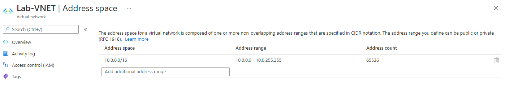
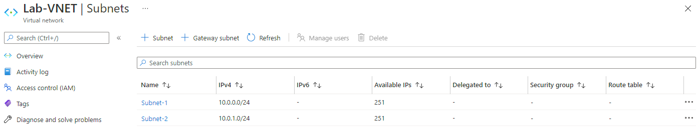
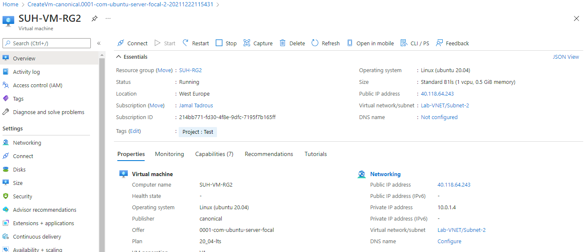
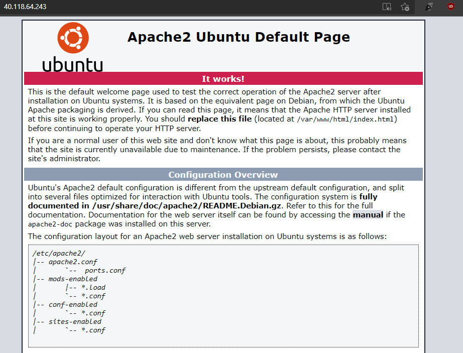

# **Azure Virtual Network (VNet)**

VNet (Azure Virtual Network) is de belangrijkste bouwsteen voor uw privénetwerk in Azure. Met VNet kunnen veel typen Azure-resources, zoals VM (Azure Virtual Machines), veilig communiceren met elkaar, internet en on-premises netwerken. VNet is vergelijkbaar met een traditioneel netwerk dat u in uw eigen datacenter zou gebruiken, maar biedt extra voordelen van de Azure-infrastructuur, zoals schaal, beschikbaarheid en isolatie.

## **Key-terms**

## **Opdracht**

**Opdracht 1:**

- Maak een Virtual Network met de volgende vereisten:

        Region: West Europe
        Name: Lab-VNet
        IP range: 10.0.0.0/16
        - Vereisten voor subnet 1:
            Name: Subnet-1
            IP Range: 10.0.0.0/24
         - Vereisten voor subnet 2:
            Name: Subnet-2
            IP Range: 10.0.1.0/24

**Opdracht 2:**

- Maak een VM met de volgende vereisten:

        Een apache server met:
            #!/bin/bash
            sudo su
            apt update
            apt install apache2 -y
            ufw allow 'Apache'
            systemctl enable apache2
            systemctl restart apache2
        Er is geen SSH access nodig, 
        wel HTTP
            Subnet: Subnet-2
            Public IP: Enabled

    Controleer of je website bereikbaar is  

### **Gebruikte bronnen**

*<https://docs.microsoft.com/nl-nl/azure/virtual-network/virtual-networks-overview>*

### **Ervaren problemen**

*Geen*

### **Resultaat**

**Opdracht 1:**

**Opdracht 2:**

