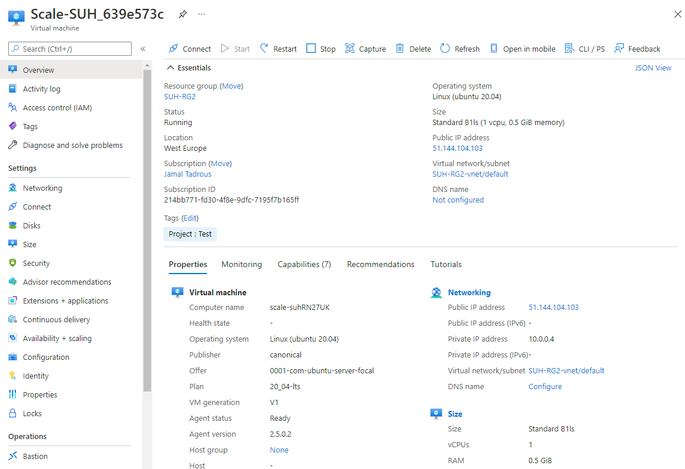
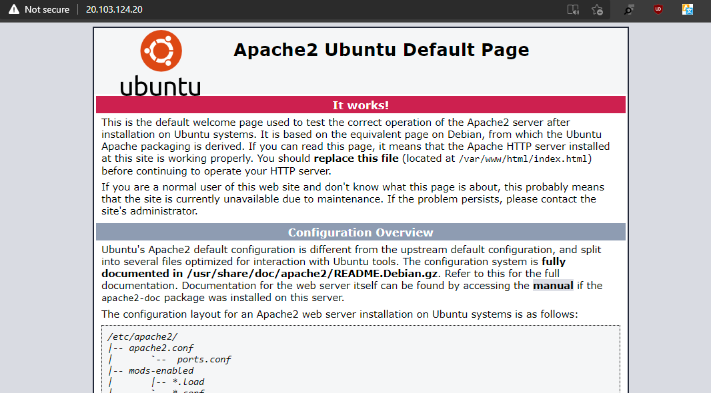
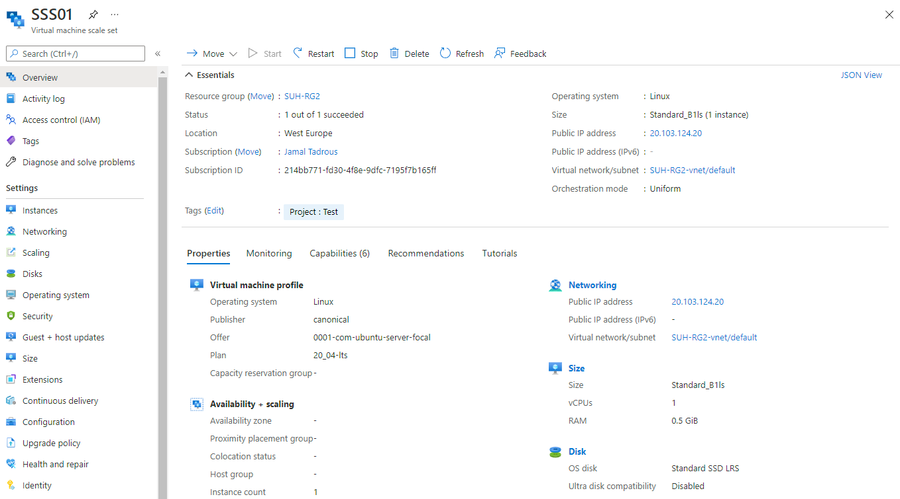
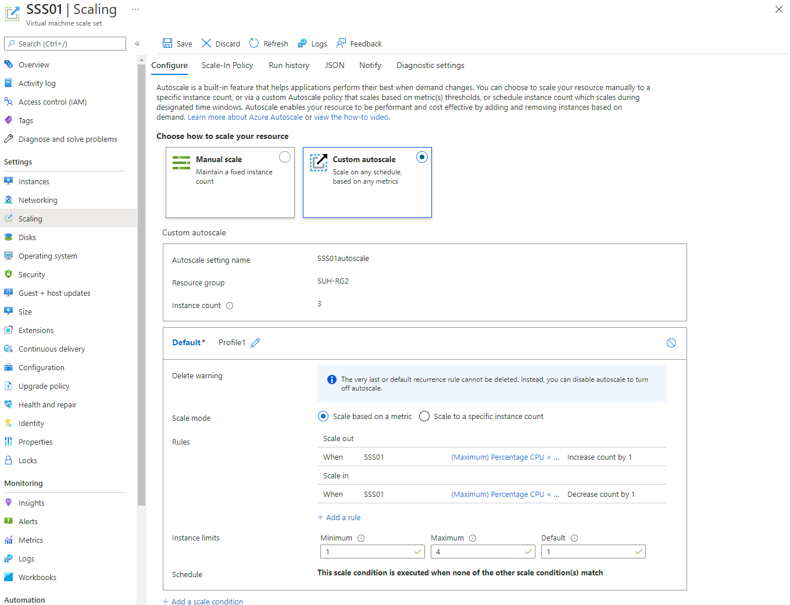
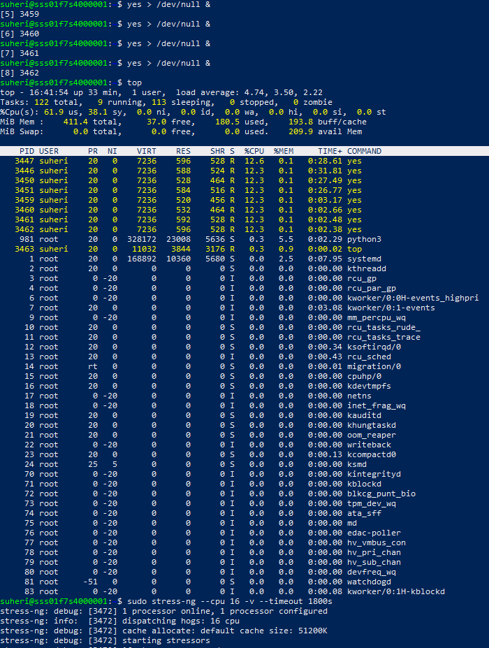
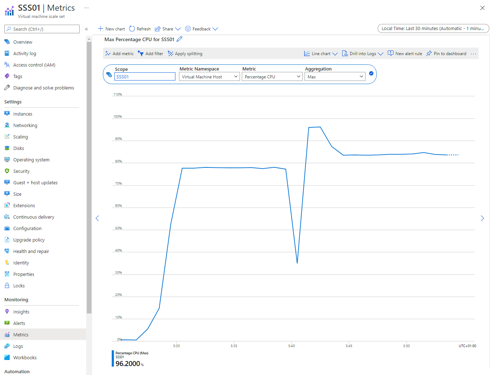
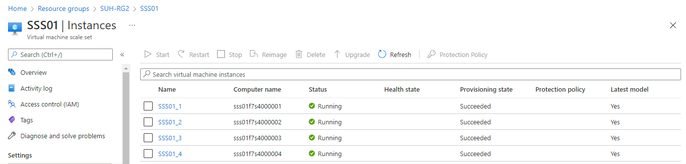

# **Azure Load Balancer (ALB) & Auto Scaling**

Een van de grootste voordelen van de cloud is dat je niet hoeft te gokken hoeveel capaciteit je nodig hebt. Je kan altijd up en down schalen met on-demand services. Een van de services die dit mogelijk maakt heet Auto Scaling.

Wanneer je applicaties runt met een spiky workload, kan je een VM Scale Set aanmaken in plaats van een enkele server. Wanneer de vraag naar de applicatie hoog is, kan Auto Scaling automatisch VMs toevoegen aan je Scale Set. Wanneer de vraag omlaag gaat, kan het ook weer instances verwijderen.

Om er zeker van te zijn dat alle VMs hetzelfde zijn, moet je een image aanwijzen tijdens het configureren van een VM Scale Set. Je kan deze image later aanpassen met de reimage optie. Auto Scaling maakt gebruik van Azure Monitor om te bepalen of er VMs toegevoegd of verwijderd moeten worden.

In een traditionele architectuur maakt een client verbinding met een enkele server met een enkel publiek IP-adres. Wanneer je een fleet van servers hebt, werkt dit niet meer. Daarom kan je een load balancer gebruiken als endpoint voor de client. De load balancer zal de request forwarden naar een van de servers in je fleet en het antwoord terugsturen naar de client.

## **Key-terms**

- Azure Load Balancer
    De Azure Load Balancer werkt op laag 4 van het OSI-model (Open Systems Interconnection). Het is het enige contactpunt voor klanten. De Load balancer distribueert inkomende stromen die aan de frontend binnenkomen naar de back-end pool-instances. Deze stromen zijn afhankelijk van geconfigureerde regels voor taakverdeling en statussondes. De backend pool-exemplaren kunnen Azure Virtual Machines of instances in een virtuele machineschaalset zijn.

    - Een **Public Load Balancer** kan uitgaande verbindingen bieden voor virtuele machines (VM's) in uw virtuele netwerk. Deze verbindingen worden uitgevoerd door hun prive IP-adressen te vertalen naar openbare IP-adressen. Public load balancers worden gebruikt om het verkeer te verdelen over de VM's.

    - Een interne (of pprive) Load Balancer wordt gebruikt wanneer er alleen privé-IP's nodig zijn bij de frontend. Interne Load Balancers worden gebruikt om het verkeer in een virtueel netwerk te verdelen. De frontend van de load balancer kan worden benaderd vanuit een on-premises netwerk in een hybride scenario.

- **Azure Virtual Machine Scale Sets**

    Een Azure Virtual Machine scale set kan automatisch het aantal VM-exemplaren dat uw toepassing uitvoeren, verhogen of verlagen. Dit geautomatiseerde en elastische gedrag vermindert de beheer-overhead om de prestaties van uw toepassing te controleren en te optimaliseren. Er kunnen regels gemaakt worden die de acceptabele prestaties definiëren voor een positieve klantervaring. Wanneer aan deze gedefinieerde drempelwaarden wordt voldaan, worden automatisch schalingsregels ingesteld om de capaciteit van de Scale Sset aan te passen. U kunt ook gebeurtenissen plannen om de capaciteit van uw schaalset op vaste tijden automatisch te verhogen of te verlagen. In dit artikel wordt een overzicht gegeven van de prestatiemetrische gegevens die beschikbaar zijn en welke acties automatisch kunnen worden geschaald.

## **Opdracht**

**Opdracht 1:**

- Maak een Virtual Machine Scale Set met de volgende vereisten:

        Ubuntu Server 20.04 LTS - Gen1
        Size: Standard_B1ls
        Allowed inbound ports:
        SSH (22)
        HTTP (80)
        OS Disk type: Standard SSD
        Networking: defaults
        Boot diagnostics zijn niet nodig

        Custom data: 
            #!/bin/bash
            sudo su
            apt update
            apt install apache2 -y
            ufw allow 'Apache'
            systemctl enable apache2
            systemctl restart apache2
        Initial Instance Count: 2
        Scaling Policy: Custom
        Aantal VMs: minimaal 1 en maximaal 4
        Voeg een VM toe bij 75% CPU gebruik
        Verwijder een VM bij 30% CPU gebruik

        

**Opdracht 2:**

- Controleer of je via het endpoint van je load balancer bij de webserver kan komen.

 

- Voer een load test uit op je server(s) om auto scaling the activeren. Er kan een delay zitten in het creëren van nieuwe VMs, afhankelijk van de settings in je VM Scale Set.

 

 

 

 

 

### **Gebruikte bronnen**

*<https://wiki.ubuntu.com/Kernel/Reference/stress-ng>*

*<https://www.cyberciti.biz/faq/stress-test-linux-unix-server-with-stress-ng/>*

*<https://docs.microsoft.com/en-us/azure/load-balancer/load-balancer-overview>*

*<https://docs.microsoft.com/en-us/azure/virtual-machine-scale-sets/virtual-machine-scale-sets-autoscale-overview>*

### **Ervaren problemen**

*Geen*

### **Resultaat**

