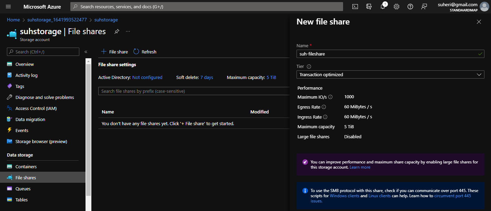

# **Azure Files**

Azure FIles biedt fully managed file shares aan in de cloud die toegankelijk zijn via het Server Message Block (SMB) protocol of het Network File System (NFS) protocol.

## **Key-terms**

[**SMB**](https://nl.wikipedia.org/wiki/Server_Message_Block)

    Server Message Block (SMB), ook bekend als Common Internet File System (CIFS), is het netwerkprotocol dat gebruikt wordt om in Microsoft Windows bestandsuitwisseling tussen meerdere computers mogelijk te maken.

[**NFS**](https://nl.wikipedia.org/wiki/Network_File_System)

    Het Network File System, of kortweg NFS, is een netwerkbestandssysteem dat oorspronkelijk werd ontworpen door Sun Microsystems in 1984 voor hun eigen Unix-werkstations. NFS maakt het mogelijk om bestanden op te vragen over het netwerk op dezelfde manier als men dit zou doen voor bestanden op de lokale schijf.

## **Opdracht**

- Bestudeer Azure Files

### **Gebruikte bronnen**

*<https://docs.microsoft.com/nl-nl/azure/storage/files/storage-files-introduction>*
*<https://docs.microsoft.com/en-us/windows/win32/fileio/microsoft-smb-protocol-and-cifs-protocol-overview>*
*<https://nl.wikipedia.org/wiki/Server_Message_Block>*
*<https://nl.wikipedia.org/wiki/Network_File_System>*

### **Ervaren problemen**

*Geen*

### **Resultaat**

*Waar is Azure Files voor?*

    Kan worden gebruikt om bestandsservers of NAS-apparaten aan te vullen of te vervangen. Werkt met Windows, Linux en macOS globaal. 

*Hoe vervangt Azure Files in een klassieke setting?*

    Geen NAS of bestandsservers meer nodig. Alles kan in de cloud worden opgeslagen en worden benaderd.

*Hoe kan ik Azure Files combineren met andere diensten?*

    Het is mogelijk Azure Files te combineren met bestandsservers en/of NAS-apparaten.    

*Wat is het verschil tussen Azure Files en andere gelijksoortige diensten?*

    Containerisatie van file shares. 
    Instellingen voor gedeelde toepassingen
    Fully managed
    Beschikbaarheid
    Makkelijk te schalen

*Waar kan ik deze dienst vinden in de console?*

    Onder Storage Account.
         

*Hoe zet ik deze dienst aan?*

*Hoe kan ik deze dienst koppelen aan andere resources?*
