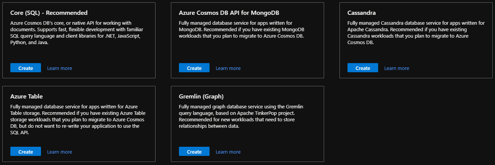
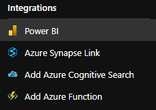

# **CosmosDB**

Azure Cosmos DB is een volledig beheerde NoSQL-databaseservice voor de ontwikkeling van moderne apps met een hoge responstijd, automatische instant schaling, SLA beschikbaarheid van 99,999% en serverloos.

**Voordelen:**

- **Gegarandeerde snelheid op elke schaal**
    - Realtime toegang met snel lees- en schrijflatentie wereldwijd, en doorvoer en consistentie die allemaal worden gebacked door SLA's.
    - One-clik gegevens schrijven in meerdere regio's naar een Azure-regio
    - Opslag en doorvoer in een Azure-regio onafhankelijk en flexibel schalen voor een onbeperkte schaal wereldwijd.

- **Vereenvoudigde toepassingsontwikkeling**
    - Snel bouwen met open source-API's, meerdere SDK's, schemaloze gegevens en geen ETL-analyse over operationele gegevens.

- **Mission-critical ready**
    - Garandeer bedrijfscontinuïteit, 99,999% beschikbaarheid en beveiliging op ondernemingsniveau voor elke toepassing.

- **Volledig beheerd en kosteneffectief**
    - End-to-end databasebeheer, met serverloze en automatische schaalvergroting die overeenkomt met uw toepassing en TCO (Total Cost of Ownership)-behoeften

 

**Effectief voor:**

    Elke web-, mobiele, gaming- en IoT-toepassing die enorme hoeveelheden gegevens moet verwerken, leest en schrijft op een globale schaal met bijna-reële antwoordtijden voor een verscheidenheid aan gegevens, profiteert van de gegarandeerde hoge beschikbaarheid,hoge doorvoer, lage latentie en consistentie van de hoge beschikbaarheid van CosmosDB.

 

## **Key-terms**

**NoSQL**
- NoSQL is een breed gamma aan databasemanagementsystemen die op aanmerkelijke wijze verschillen van het klassieke relationele databasemanagementsysteem (RDBMS). De datasystemen behoeven niet altijd vaste databaseschema's, ze vermijden gewoonlijk de JOIN-operaties en sommige schalen horizontaal. Academici en publicaties verwijzen er meestal naar als "gestructureerde storage", waarvan de klassieke relationele databases een deelverzameling zouden zijn. Ook wordt er soms naar verwezen als niet-relationele databases.

**SDK**
- Een software development kit (vaak afgekort tot SDK) is een verzameling hulpmiddelen die handig zijn bij het ontwikkelen van computerprogramma's voor een bepaald besturingssysteem, type hardware, desktopomgeving of voor het maken van software die een speciale techniek gebruikt.

**API**
- Een application programming interface (API) is een verzameling definities op basis waarvan een computerprogramma kan communiceren met een ander programma of onderdeel (meestal in de vorm van bibliotheken). Vaak vormen API's de scheiding tussen verschillende lagen van abstractie, zodat applicaties op een hoog niveau van abstractie kunnen werken en het minder abstracte werk uitbesteden aan andere programma's.

**ETL**
- Extraction, Transformation and Load. Het benoemt de processen die gebruikt worden om gegevens uit verschillende gestructureerde databases te verenigen in een andere database.

    - Extract: data uit een bron ophalen
    - Transform: opgehaalde data omzetten volgens regels en opzoektabellen of combinaties maken van data uit verschillende bronnen
    - Load: de data wegschrijven op een andere plaats

## **Opdracht**

- Bestudeer CosmosDB

### **Gebruikte bronnen**

*<https://docs.microsoft.com/en-us/azure/cosmos-db/>*

*<https://docs.microsoft.com/en-us/azure/cosmos-db/introduction>*

*<https://nl.wikipedia.org/wiki/NoSQL>*

*<https://nl.wikipedia.org/wiki/Software_development_kit>*

*<https://nl.wikipedia.org/wiki/Application_programming_interface>*

*<https://nl.wikipedia.org/wiki/Extraction,_Transformation_and_Load>*

### **Ervaren problemen**

*Geen*

### **Resultaat**

*Waar is CosmosDB voor?*

    Azure CosmosDB is een volledig beheerde NoSQL-database voor moderne app-ontwikkeling.

*Hoe vervangt CosmosDB in een klassieke setting?*

    Geen on-premis database meer nodig. Fully mamanged in de cloud. 

*Hoe kan ik CosmosDB combineren met andere diensten?*

    Ondersteuning voor open source API's en SDK's voor populaire talen. Hybride platform voor Cassandra-gegevens. Real-time analyse middels Azure Synapse Link.

*Wat is het verschil tussen CosmosDB en andere gelijksoortige diensten?*

    Serverloos, dus makkelijk te schalen. Pay-as-you-go.  

*Waar kan ik deze dienst vinden in de console?*

*Hoe zet ik deze dienst aan?*

*Hoe kan ik deze dienst koppelen aan andere resources?*

