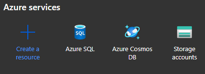
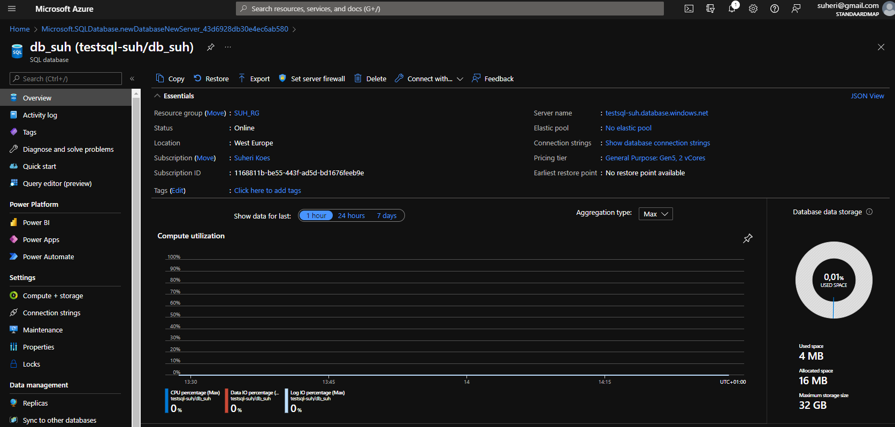
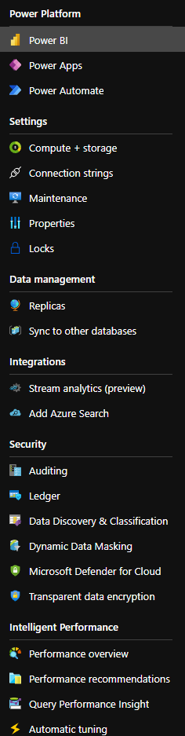

# **Azure Database**

Azure biedt verschillende volledig beheerde relationele, NoSQL- en in-memory databases die bedrijfseigen en opensource-engines omvatten en zijn afgestemd op de behoeften van moderne app-ontwikkelaars. Infrastructuurbeheer, waaronder schaalbaarheid, beschikbaarheid en beveiliging, is geautomatiseerd.

|  Funtie	 |  Database  |
| -- | -- |
|  Beheerde, intelligente SQL in de cloud	|  Azure SQL Database  |  
|  Beheerde, altijd up-to-date SQL-instantie in de cloud	|  Azure SQL Managed Instance
|  Migreer uw SQL-workloads naar Azure met behoud van de volledige compatibiliteit met SQL Server en de toegang tot het besturingssysteem	|  SQL Server op Virtual Machines
|  Bouw schaalbare, veilige en volledig beheerde apps voor bedrijven op basis van opensource-PostgreSQL voor de community. Breid PostgreSQL met één knooppunt uit met hoge prestaties of migreer de PostgreSQL- en Oracle-workloads naar de cloud	|  Azure Database voor PostgreSQL
|  Bied een hoge beschikbaarheid en elastische schaalmogelijkheden voor opensource-apps (mobiel en webgebaseerd) met een beheerde communityversie van de MySQL-databaseservice, of migreer de MySQL-workloads naar de cloud	|  Azure Database voor MySQL
|  Bied een hoge beschikbaarheid en elastische schaalmogelijkheden voor opensource-apps (mobiel en webgebaseerd) met een beheerde communityversie van de MariaDB-databaseservice	|  Azure Database voor MariaDB
|  Bouw toepassingen met een gegarandeerde lage latentie en een hoge beschikbaarheid (overal en op elke schaal), of migreer Cassandra-, MongoDB- en andere NoSQL-workloads naar de cloud	|  Azure Cosmos DB
|  Bied snelle, schaalbare toepassingen met een in-memory gegevensarchief dat compatibel is met opensource-middelen	|  Azure Cache voor Redis
|  Versnel de overstap naar de cloud aan de hand van een eenvoudig, onbegeleid migratieproces	|  Azure Database Migration Service
|  U kunt bestaande Cassandra-gegevensclusters en -apps moderniseren en profiteren van flexibiliteit en vrijheid met service voor beheerd exemplaar	|  Azure Managed Instance voor Apache Cassandra

**Azure SQL Database**

SQL Database levert voorspelbare prestaties met meerdere resourcetypen, servicelagen en rekengrootten. Het biedt dynamische schaalbaarheid zonder downtime, ingebouwde intelligente optimalisatie, globale schaalbaarheid en beschikbaarheid en geavanceerde beveiligingsopties.

- PaaS
- 99,99% beschikbaarheid
- Zowel relationele gegevens als niet-relationelestructuren kunt verwerken, zoals grafieken, JSON, ruimtelijk en XML
- Nieuwste SQL Server zonder overhead voor het patchen of upgraden, getest in miljoenen databases.
- Nieuwste mogelijkheden eerst SQL Database, later server implementatie.
- Twee modellen:
    - [vCore gebaseerd aankoopmodel](https://docs.microsoft.com/nl-nl/azure/azure-sql/database/service-tiers-vcore)
    - [DTU gebaseerd aankoopmodel](https://docs.microsoft.com/nl-nl/azure/azure-sql/database/service-tiers-dtu)

- Azure SQL Database biedt de volgende implementatieopties voor een database:

    - Eén database vertegenwoordigt een volledig beheerde, geïsoleerde database. U kunt deze optie gebruiken als u moderne cloudtoepassingen en microservices hebt die één betrouwbare gegevensbron nodig hebben. Eén database is vergelijkbaar met een database in de SQL Server database-engine.
    - Elastic pool is een verzameling van enkele databases met een gedeelde set resources, zoals CPU of geheugen. Afzonderlijke databases kunnen in en uit een elastische groep worden verplaatst.

- Schaalbare prestaties en pools

    - Met afzonderlijke databases is elke database geïsoleerd van andere databases en is deze overdraagbaar. Elk heeft zijn eigen gegarandeerde hoeveelheid reken-, geheugen- en opslagbronnen. De hoeveelheid resources die aan de database zijn toegewezen, is toegewezen aan die database en wordt niet gedeeld met andere databases in Azure. 
    - Met elastische pools kunt u resources toewijzen die worden gedeeld door alle databases in de groep. U kunt een nieuwe database maken of de bestaande databases verplaatsen naar een resourcegroep om het gebruik van resources te maximaliseren en geld te besparen. Deze optie biedt u ook de mogelijkheid om elastische poolbronnen dynamisch omhoog en omlaag te schalen.

- Inkoopmodellen

    - Met het op vCore gebaseerde aankoopmodel kunt u het aantal vCores, de hoeveelheid geheugen en de hoeveelheid en snelheid van opslag kiezen. Met het op vCore gebaseerde aankoopmodel is het mogelijk Azure Hybrid Benefit gebruiken om SQL Server kosten te besparen.
    - Het op DTU gebaseerde aankoopmodel biedt een combinatie van compute-, geheugen- en I/O-resources in drie servicelagen, ter ondersteuning van lichte tot zware databasebelastingen. Rekengrootten binnen elke laag bieden een andere mix van deze resources, waaraan u extra opslagbronnen kunt toevoegen.
    - Het serverloze model schaalt automatisch de berekening op basis van de werkbelastingsvraag en facturen voor de hoeveelheid berekening die per seconde wordt gebruikt. De serverloze rekenlaag pauzeert databases ook automatisch tijdens inactieve perioden wanneer alleen opslag wordt gefactureerd en worden databases automatisch hervat wanneer de activiteit terugkeert.

- Azure SQL Database biedt drie servicelagen die zijn ontworpen voor verschillende typen toepassingen:

    - Algemene doel/standaardservicelaag die is ontworpen voor algemene werkbelastingen. Het biedt gebudgetteerde, gebalanceerde reken- en opslagopties.
    - Business Critical/Premium service tier designed for OLTP applications with high transaction rate and lowest-latency I/O.Business Critical/Premium service tier designed for OLTP applications with high transaction rate and lowest-latency I/O. Het biedt de hoogste tolerantie voor fouten met behulp van verschillende geïsoleerde replica's.
    - Hyperscale-servicelaag die is ontworpen voor zeer grote OLTP-database en de mogelijkheid om opslag automatisch op te schalen en gegevens te schalen.

- Azure SQL Database biedt geavanceerde functies voor monitoring en probleemoplossing die u helpen om meer inzicht te krijgen in de werkbelastingskenmerken. Deze functies en hulpprogramma's zijn:

    - De ingebouwde controlemogelijkheden die worden geleverd door de nieuwste versie van de SQL Server database-engine. Ze stellen u in staat realtime prestatie-inzichten te vinden.
    - PaaS-monitoringmogelijkheden van Azure waarmee u een groot aantal database-exemplaren kunt controleren en oplossen.

## **Key-terms**

Zie hierboven :)

## **Opdracht**

- Bestudeer Azure Database

### **Gebruikte bronnen**

*<https://azure.microsoft.com/nl-nl/product-categories/databases/>*

*<https://docs.microsoft.com/nl-nl/azure/azure-sql/database/sql-database-paas-overview>*

### **Ervaren problemen**

*Geen*

### **Resultaat**

*Waar is Azure Database voor?*

    Gegevensopslag voor toepassingen en oplossingen in Azure.

*Hoe vervangt Azure Database in een klassieke setting?*

    Omdat het in de cloud draait geen fysieke server meer nodig. Geen onderhoud nodig. Makkelijk schaalbaar. Kosten-efficient.

*Hoe kan ik Azure Database combineren met andere diensten?*

    Goede integratie in de cloud waardoor er extra functionaliteit wordt teogevoegd. Bijvoorbeeld Active Directory voor gebruikersbeheer. 

*Wat is het verschil tussen Azure Database en andere gelijksoortige diensten?*

    Kan serverloos, dus makkelijk te schalen. Pay-as-you-go.  Goede integratie in Azure platform.

*Waar kan ik deze dienst vinden in de console?*

*Hoe zet ik deze dienst aan?*

*Hoe kan ik deze dienst koppelen aan andere resources?*

