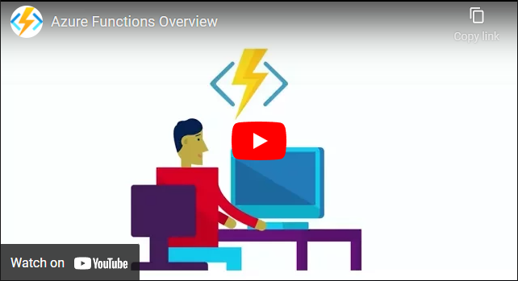
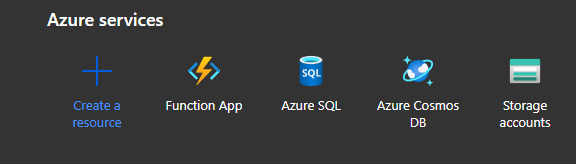
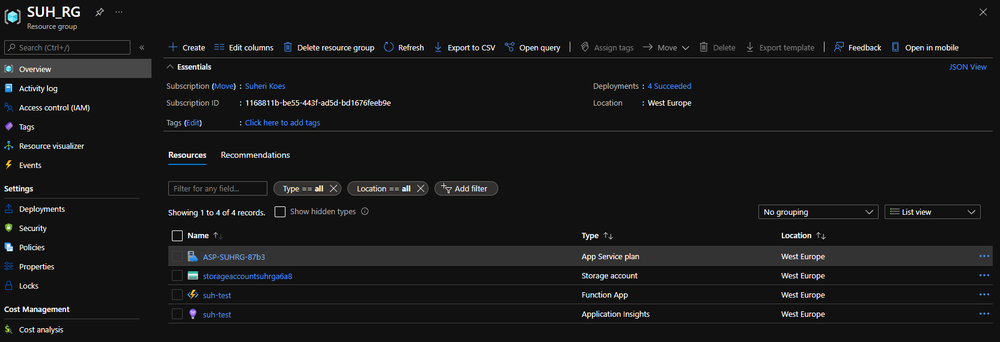
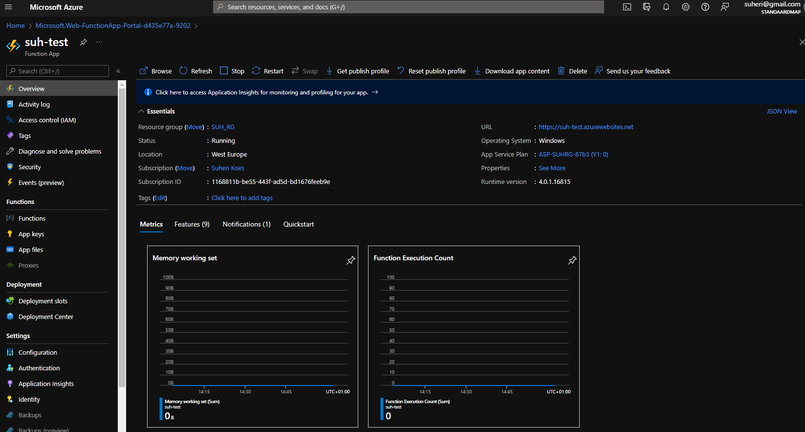
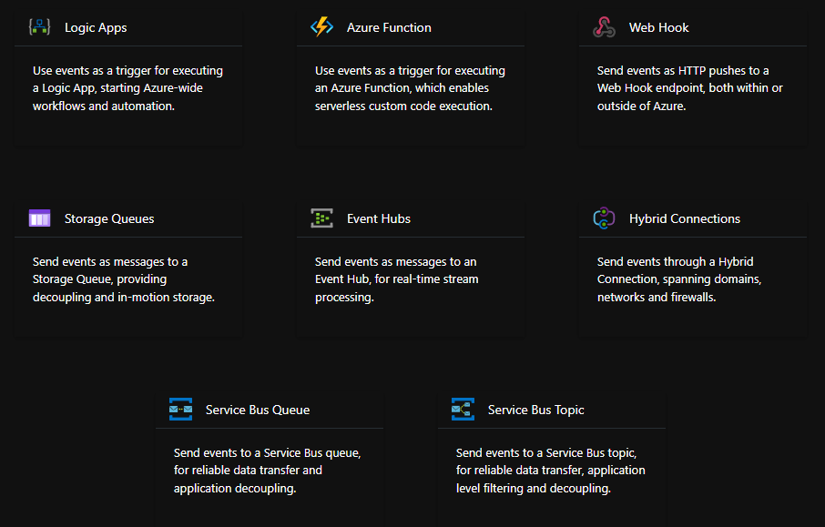

# **Azure Functions**

Azure Functions is een serverloze oplossing waarmee minder code nodig is, minder te onderhouden infrastructuur en kostenbeparend. De cloudinfrastructuur biedt alle bijgewerkte resources die nodig zijn om toepassingen uit te voeren.

**Azure Functions**
    
    Eigen code die wordt uitgevoerd op een gebeurtenis zoals REST-request, timer of Azure notificatie. Schaalt automatisch. Betaal alleen voor gebruikte CPU resources. Functions kunnen stateless (standaard, reset) of statefull (Durable, context ivm eerdere actviteiten).

**Azure Logic Apps**

    Logic Apps voeren workstreams uit om bedrijfsscenario's te automatiseren welke opgebouwd zijn uit vooraf gedefinieerde blokken via triggers. Implementatie via GUI.

|   | AZ Functions  | AZ Logic Apps  |
|---|---|---|
| Staat  | Normaal staatloos, maar stateful is mogelijk met Durable Functions.  |  Stateful |
| Ontwikkeling  |  Code-first (imperatief) | Designer-first (declaratief)  |
|  Connectiviteit |  Circa tien ingebouwde bindingstypen. Schrijf code voor aangepaste bindingen. | Grote verzameling connectors. Enterprise Integration Pack voor B2B-scenario's. Bouw aangepaste connectors.  |
| Acties  | Elke activiteit is een Azure-functie. Schrijf code voor de activiteitsfuncties  | Grote verzameling kant-en-klare acties  |
|  Bewaking | Azure Application Insights  | Azure Portal, Log Analytics  |
|  Beheer | REST API, Visual Studio  | Azure Portal, REST API, PowerShell, Visual Studio  |
|  Context voor uitvoering  |  Lokaal of Cloud  |  Cloud-only  |

**Voordelen:**

- Uw voorkeurstaal gebruiken: Schrijf functies in C#, Java, JavaScript, PowerShell of Python of gebruik een aangepaste handler om vrijwel elke andere taal te kunnen gebruiken.

- Implementatie automatiseren: Bij een op hulpprogramma's gebaseerde benadering voor het gebruik van externe pijplijnen zijn er talloze implementatieopties beschikbaar.

- Problemen met een functie oplossen: Gebruik controlehulpprogramma's en teststrategieën om inzicht te krijgen in uw apps.

- Flexibele prijsopties: Bij het Verbruiksabonnement betaalt u alleen voor uw functies wanneer deze worden uitgevoerd. De Premium- en App Service-abonnementen bieden functies voor speciale behoeften.

## **Opdracht**

- Bestudeer Azure Functions

### **Gebruikte bronnen**

*<https://docs.microsoft.com/en-us/azure/azure-functions/functions-overview>*

### **Ervaren problemen**

*Geen*

### **Resultaat**

*Waar is Azure Functions voor?*

- Een serverloze oplossing die in de cloud wordt uitgevoerd.

*Hoe vervangt Azure Functions in een klassieke setting?*

- Geen dedicated host meer nodig om de code uit te voeren.

*Hoe kan ik Azure Functions combineren met andere diensten?*

- Goede integratie met andere Azure diensten. Zie [hier](https://docs.microsoft.com/nl-nl/azure/azure-functions/functions-triggers-bindings?tabs=csharp)

*Wat is het verschil tussen Azure Functions en andere gelijksoortige diensten?*

- 

*Waar kan ik deze dienst vinden in de console?*

*Hoe zet ik deze dienst aan?*

*Hoe kan ik deze dienst koppelen aan andere resources?*

