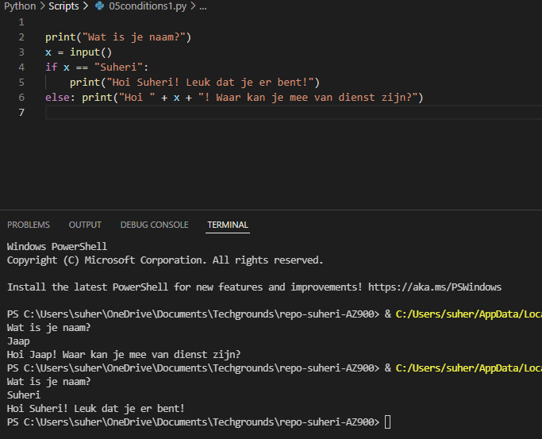
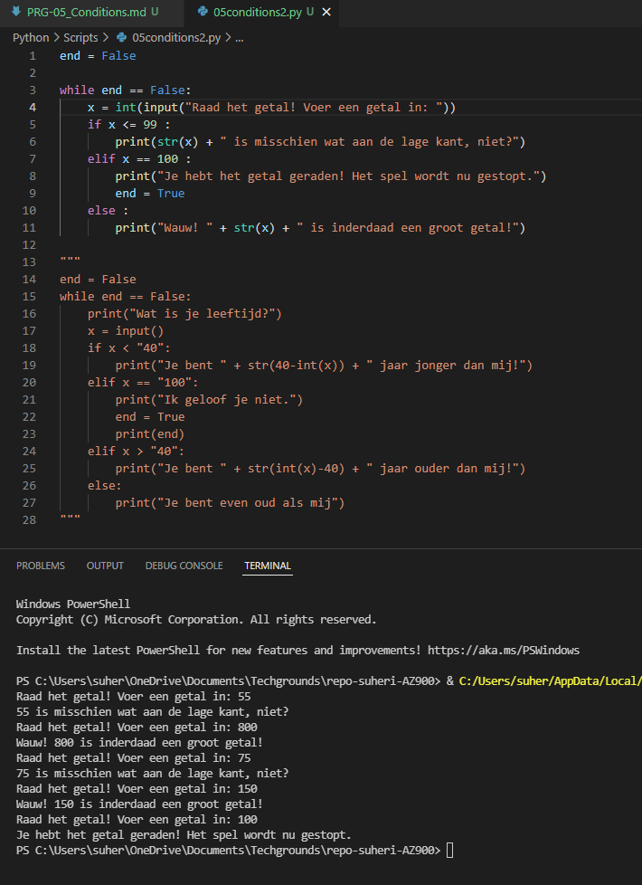

# **Conditions**

## **Opdracht 1**

    Create a new script.
    Use the input() function to ask the user of your script for their name. If the name they input is your name, print a personalized welcome message. If not, print a different personalized message.

[Code](../06_Python/Scripts/05conditions1.py)

## **Opdracht 2**

    Create a new script.
    Ask the user of your script for a number. Give them a response based on whether the number is higher than, lower than, or equal to 100.
    Make the game repeat until the user inputs 100.

[Code](../06_Python/Scripts/05conditions2.py)

### **Gebruikte bronnen**

*<https://www.w3schools.com/python/python_conditions.asp>*
