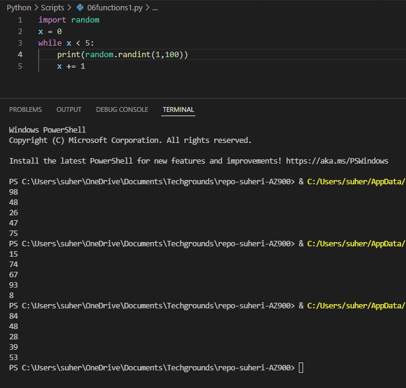
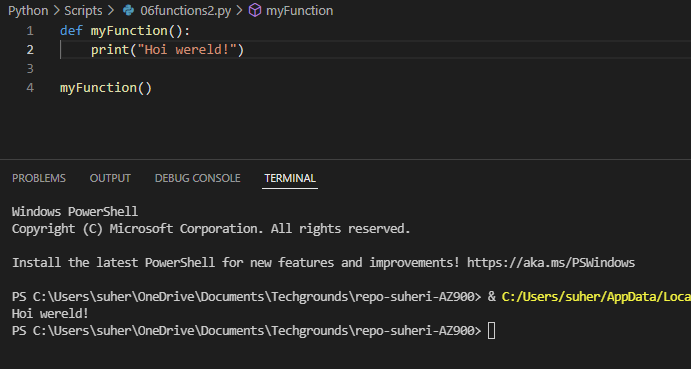
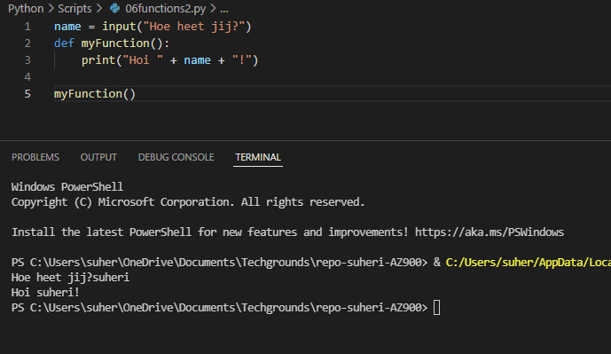
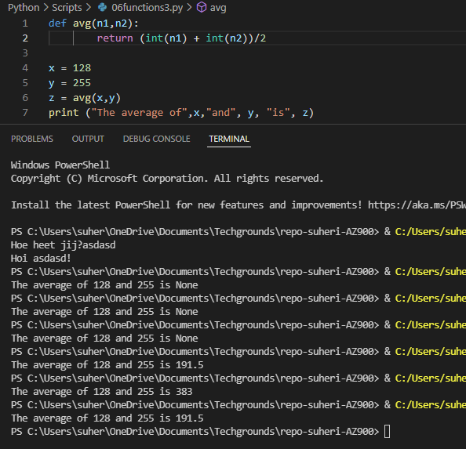

# **Functions**

## **Opdracht 1**

    Create a new script.
    Import the random package.
    Print 5 random integers with a value between 0 and 100.

[Code](../06_Python/Scripts/06functions1.py)

## **Opdracht 2**

    Create a new script.
    Write a custom function myfunction() that prints “Hello, world!” to the terminal. Call myfunction.

    Rewrite your function so that it takes a string as an argument. Then, it should print “Hello, <string>!”.

    

[Code](../06_Python/Scripts/06functions2.py)

## **Opdracht 3**

    Create a new script.
    Copy the code below into your script.
    def avg():
        # write your code here
    
    x = 128
    y = 255
    z = avg(x,y)
    print ("The average of",x,"and", y, "is", z)
    Write the custom function avg() so that it returns the average of the given parameters.

[Code](../06_Python/Scripts/06functions3.py)

### **Gebruikte bronnen**

*<https://www.w3schools.com/python/python_functions.asp>*
