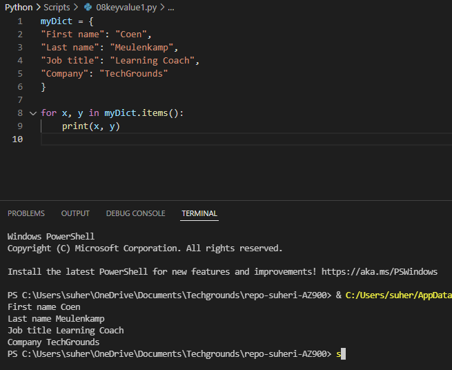
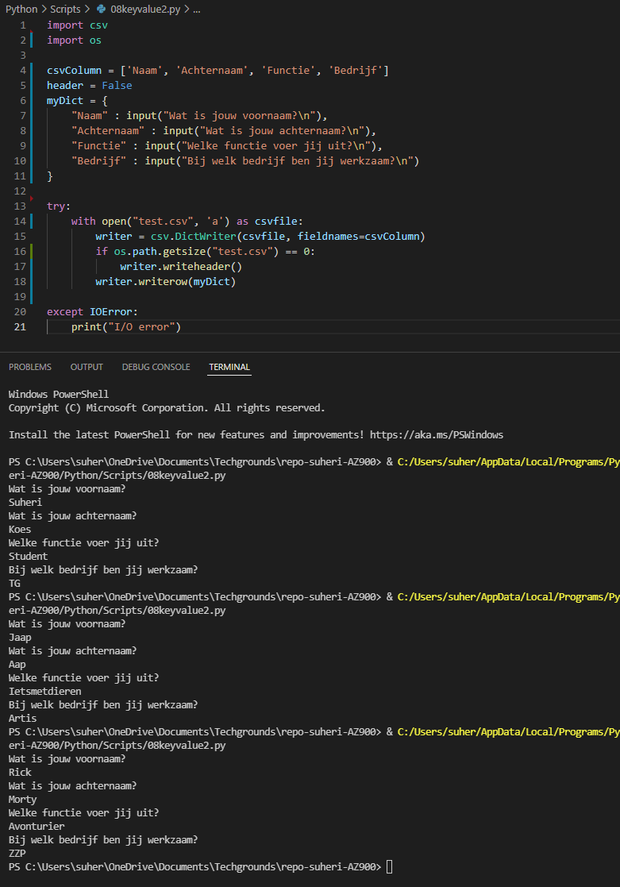
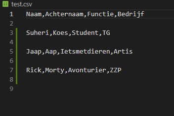

# **Key-value pairs**

## **Opdracht 1**

    Create a new script.
    Create a dictionary with the following keys and values:
        Key
        Value
        First name
        Coen
        Last name
        Meulenkamp
        Job title
        Learning Coach
        Company
        TechGrounds

    Loop over the dictionary and print every key-value pair in the terminal.

[Code](../06_Python/Scripts/08keyvalue1.py)

## **Opdracht 2**

    Create a new script.
    Use user input to ask for their information (first name, last name, job title, company). 
    Store the information in a dictionary.
    Write the information to a csv file (comma-separated values). 
    The data should not be overwritten when you run the script multiple times.

[Code](../06_Python/Scripts/08keyvalue2.py)

### **Gebruikte bronnen**

*<https://www.w3schools.com/python/python_dictionaries.asp>*

