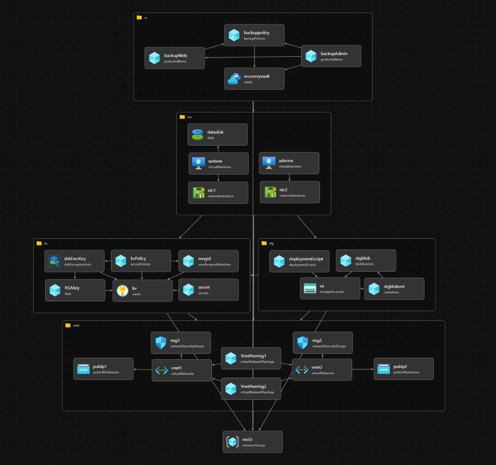
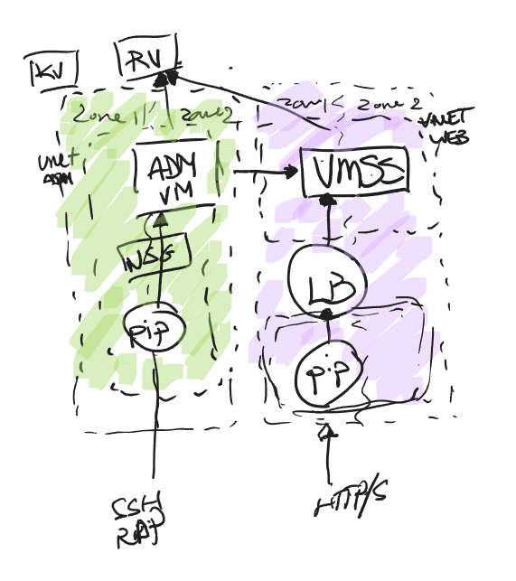
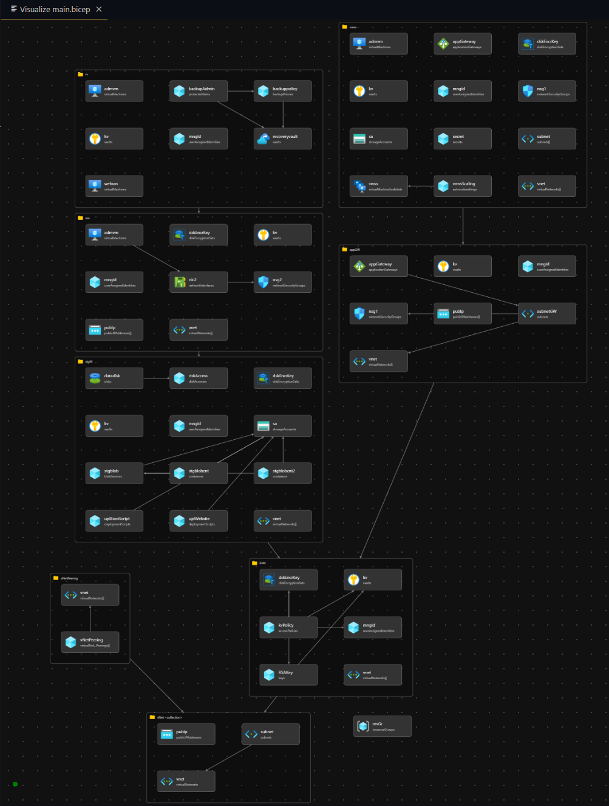
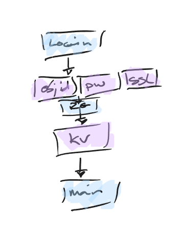
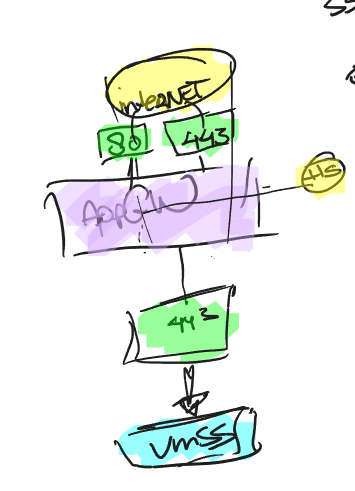

# Techgrounds/Sentia Project 1.1
### Author: Suheri Koes 
### Date: 24/03/2022

## Inhoudsopgave

- [1 Introductie](README.MD#1-introductie)
- [2 Azure Architecture Overview](README.MD#2-azure-architecture-overzicht)
- [3 Microsoft Azure Networking](README.MD#3-microsoft-azure-networking)
- [4 Microsoft Azure Storage](README.MD#4-microsoft-azure-storage)
- [5 Microsoft Azure Compute](README.MD#5-microsoft-azure-compute)
- [6 Microsoft Azure Identity](README.MD#6-microsoft-azure-identity)
- [7 Compliance & Security](README.MD#7-compliance--security)
- [8 Backup](README.MD#8-backup)
- [9 Appendix](README.MD#9-appendix)

### 1 Introductie

Dit individuele project omvat het opzetten van een webserver met een adminserver in de Azure cloud omgeving. Het doel is hier voldoende lering uit te trekken als basis voor een gedegen start bij Sentia. Het project wordt individueel gemaakt. Wanneer er bepaalde vragen of obstakels zijn, kunnen deze besproken worden in de groep. Indien er geen oplossing gevonden kan worden, kunnen mijn groep en ik terecht bij de learning coach Coen, die als stakeholder fungeert. Om deze opdracht nog iets praktischer te laten ogen en iets van narratief in te brengen, benoem ik de klant als bedrijf **XYZ**. 

XYZ wilt graag zijn webdiensten in de cloud onderbrengen. Zij hebben de volgende eisen aangeven voor hun architectuur:

- Alle VM disks moeten **encrypted** zijn.
- De webserver moet dagelijks gebackupt worden. De backups moeten 7 dagen behouden worden.
- De webserver moet op een geautomatiseerde manier geïnstalleerd worden.
- De admin/management server moet bereikbaar zijn met een publiek IP.
- De admin/management server moet alleen bereikbaar zijn van vertrouwde locaties (office/admin’s thuis)
- De volgende IP ranges worden gebruikt: **10.10.10.0/24 & 10.20.20.0/24**
- Alle subnets moeten beschermd worden door een firewall op subnet niveau.
- SSH of RDP verbindingen met de webserver mogen alleen tot stand komen vanuit de admin server.

**Deadlines:**

| Onderwerp: | Datum (projectweek): |
| --- | --- |
| Start Python, Start Project (v1.0) | 07-02-2022 (wk 1)|
| Sprint 1 Review progressie app v1.0 | 25-02-2022 (wk 3)|
| Sprint 2 Review oplevering app v1.0 | 11-03-2022 (wk 5)|
|Introductie Project v1.1 | 14-03-2022 (wk 5)|
| Sprint 3 Review progressie app v1.1 | 25-03-2022 (wk 7)|
| Oplevering- / Eindpresentatie Sprint 4 Review oplevering app v1.1 / Eindpresentatie | 08-04-2022 (wk 9)|

**Architectuur ontwerp**

Het volgende ontwerp is meegeleverd door de cloud-architect:

Hieruit kan het inventaris worden opgemaakt:

    - 2 Public IP's
    - 1 Keyvault nodig voor certificaten en keys/encryptie
    - 2 V-Nets in 2 availibilty zones verbonden middels peering
    - 1 Subnet met NSG voor webserver
    - 1 Subnet met NSG voor adminserver
    - 1 VM webserver met SSH/RDP via adminserver
    - 1 VM adminserver
    - 1 Storage account voor post-deployment scripts

Ondanks enkele variabelen heb ik deze aannames gemaakt:

    - XYZ wilt een veilige applicatie waarmee een werkende web- en adminserver wordt deployed.
    - Verkeer webserver verloopt via PIP.
    - RDP/SSH webserver middels een adminserver (peering), bereikbaar via een PIP met trusted locations.
    - NSG's op subnet-niveau geconfigureerd als firewall ter beveiliging.
    - XYZ gebruikt Linux en Windows (SSH/RDP)

Tijdens de eerste meeting met XYZ is het volgende besproken:

    - Backup -> alles?
    ----- Motivatie voor (extra) kosten. 
    - Webserver PIP voor extern gebruik? Schaalbaar? Hoeveelheid verkeer/Functie?
    ----- Simpele server
    - Kosten/budget
    ----- 130
    - Active Directory users in het huidige systeem?
    ----- Nee. Instellen voor XYZ.
    - Webserver OS? Meer vereisten?
    ----- Windows admin. Linux evt goedkoper voor webserver.
    - Admin server exclusief voor webserver? Andere functionaliteit? Hoeveel users toegang?
    ----- Admin server gaat fungeren net als 'Azure Bastion' Aantal admins uit te breiden.
    - Cloudopslag alleen voor bootscripts (en backups). Users?
    ----- Blob Storage vanwege het makkelijk uit te breiden voor eventuele extra opslag.
    - Tijdstip backups? 
    ----- Buiten kantoortijden
    - Regio
    ----- West-Europa, maar de IaC (Infractructure as Code) dient agnostisch te zijn

### 2 Azure Architecture Overzicht

#### Dependancies

 
Gezien de gevraagde diensten vaak afhankelijk zijn van elkaar, dient de deployment in een bepaalde volgorde te worden uitgevoerd.

Volgorde van deployment:

ResourceGroup > vNet > Keyvault > VM's > Recoveryvault  

*v1.0*

Versie 1.1 brengt nog enkele extra diensten in de IaC.
Er wordt een Application Gateway gebruikt om het verkeer te verdelen over de virtual machine scaleset. Ook beveiligt deze 'normaal' http verkeer naar TLS. 

Met de wijzigingen van v1.1 wordt zijn dit de gemaakte dependacies en deploy-volgorde van de gemaakte modules:

*v1.1*
Naar mate ik wat meer inzicht in de stof begon te krijgen, ben ik deze ook beter toe gaan passen. Door het efficienter indelen van de resources is de deployment tijd verminderd naar +/- 7 minuten met alle extra resources benodigd voor v1.1.

Zoals op de afbeeldingen te zien zijn de resources in opgedeeld in modules. 
Modules worden gebruikt om resources makkelijker op scopes te deployen. Zijn modulair en kunnen dus hergebruikt worden wat scheelt in toekomstige wijzigingen.  

#### Subscription
De bicep wordt uitgevoerd op subscriptie-niveau voor de vereenvoudigde deployment. De deployment kan worden uitgevoerd op Azure account van de klant mits de juiste variabelen worden meegegeven in de 'params.json'.

#### Benaming
Volgende tags worden geimplementeerd om overzicht te houden bij meerdere deployments:

| Key | Value |
| ---- | ---- |
| Client | -naam- |
| Version | -versie- |
| Environment | -dev/prod-|

Indien er andere tags toegevoegd dienen te worden, is het mogelijk in de params.json extra tags aan te maken. 

#### KeyVault
Er wordt in de deployment ook een keyvault aangemaakt via de Powershell. De encryptiekey wordt bij installatie automatisch gegenereerd om de data schijven te encrypten. Via portal of CLI is het mogelijk deze te vervangen voor uw eigen sleutel. De omgeving staat ingesteld dat de schijven automatisch uw sleutel gebruiken (rotational).
SSL cerificaatwordt uitgelezen indien aangeleverd en tijdens de deployment wordt om het bijhorende wachtwoord gevraagd. Indien niet aanwezig wordt er een placeholder certificaat gegenereerd. Welke uiteraard naderhand te vervangen is.

#### Regio
De infrastructuur wordt gedeployed in regio **West-Europa** vanwege de gunstige ligging van het bedrijf en haar klanten. De IaC wordt vanuit een agnostisch oogpunt ontworpen zodat de IaC ook deployed kan worden in eventuele andere regio's wanneer dat nodig zou zijn. Het enige wat u dient te wijzigen is de locatie in 'params.json'. 
NB. *De beschikbare (compute) resources en prijzen kunnen per regio verschillen.*

#### Administrative Roles
Er wordt een admin rol aan de deployment-account toegewezen. Indien er meerdere rollen nodig zijn, is het mogelijk deze toe te voegen via de portal of CLI.

### 3 Microsoft Azure Networking

#### VNET #1
- Benaming: "app-prd-vnet"
- Bereik: 10.10.0.0/16
- 2 subnets
    - 10.10.10.0/24 (subnet1 - VM ScaleSet)
    - 10.10.20.0/24 (Application Gateway)
- 1 statisch publiek IP voor toegang tot de website via de Application Gateway via poort 80 en 443. 80 wordt automatisch omgeleid naar 443. 

#### VNET #2
- Benaming: "management-prd-vnet"  
- Bereik: 10.20.20.0/24
- 1 subnet
- 1 statisch publiek ip voor admin toegang

#### Peering
Er worden twee peering resources aangemaakt waardoor de twee virtuele netwerken volledige verbinding hebben met elkaar. In de IaC is de resource gescheiden van de v-nets vanwege de modulariteit en de dependencies.

### 4 Microsoft Azure Storage

#### Encryption
Alle schijven van de VM's worden tijdens de installatie versleuteld. Tijdens de deployment wordt er een encryptiesleutel gegenereerd door Azure. Deze is via CLI of portal te wijzigen naar geschikte sleutel naar keuze. Azure staat ingesteld om de encryptie van de schijven automatisch te verwerken.

#### Storage Account
Voor de opslag is er een Storage Account aangemaakt. Hier wordt een blobcontainer ingezet met de naam 'bootstrapdata'. 
Tijdens de deployment wordt het init script voor de webserver in de blobcontainer gezet. Ook wordt er een container gemaakt 'website'. De webfiles worden automatisch in de container gezet en is gelinkt aan de VMSS bij initialiseren. 

#### Hard Disk
De volgende harde schijven zijn in het huidige model geimplementeerd:
- Lokaal redundant standaard SSD 30 GB voor de Web Server
- Lokaal redundant standaard SSD 50 GB voor de data schijf van de Web Server (Deze staat momenteel niet geactiveerd. Gezien de webserver lokaal wordt gedraaid op elke VM, is er geen behoefte aan een externe snelle disk. Indien er toch meer performance nodig is voor de webfiles is het mogelijk de dataschijf aan te zetten. Om deze te activeren tijdens de deployment, wijzig de parameter 'extDisk' naar 'true')
- Lokaal redundant standaard SSD 120 GB voor de Admin Server (Minimum van Windows SKU)

### 5 Microsoft Azure Compute

#### Webserver
- Opgezet in West Europa met 'Availability Zoning' in zone 1.
- Instellingen worden extra veilig ingesteld. SSH en RDP alleen via de Admin-server en publiek verkeer alleen op TLS via de loadbalancer. De schaling staat ingesteld op hoeveelheid van inkomende verbindingen en de gemeten CPU-load van de VM('s).
- Grootte VM: Standard_B2s = 2 vCPU/4GB RAM ($35.04/maand) --> Bij reservering 1jr $20.49/maand en 3jr $13.19/maand
- OS = Ubuntu 20.04 LTS

Instap VM-grootte gekozen en  gelet op de prijs. Indien er meer capaciteit nodig is, is het mogelijk om horizontaal en verticaal te schalen.
Bij installatie wordt er Apachev2 geinstalleerd als webserver. Dit bootscript wordt als eerst centraal in een blob container bewaard, waarna elke VM dit script kan bereiken. Ook wordt tijdens de deployment de web files opgehaald van een interne of externe URI. Elke VM draait dus de laatste versie van de website. Bij downscaling wordt de oudste VM als eerste verwijderd, zodoende is er rotatie en geen behoefte aan een cron-script.

#### Administratieserver 
- Opgezet in West Europa met 'Availability Zoning' in zone 1
- Instellingen worden extra veilig ingesteld
- Grootte VM: Standard_B2s = 2 vCPU/4GB RAM ($35.04/maand)
- OS = Windows 2022 Datacenter Azure

Minimale virtuele windows server opgezet in de cloud. Deze VM is alleen te bereiken via SSH en RDP. Ook is het mogelijk dat er maar vanaf een ip kan worden ingelogd (Zie manual.md]). Alleen via deze VM is de webserver te bereiken via SSH en RDP en is er volledige toegang mogelijk tot alle VM's waar nodig.

### 6 Microsoft Azure Identity

#### Policy

Middels de managed policy worden rechten aan de gebruiker toegewezen. Deze heeft hierdoor volledige controle over de VM's, de Keyvault en de Recoveryvault.
Meerdere rollen mogelijk door policies toe te voegen in de CLI of portal. Neem hiervoor contact op met uw consultant.

### 7 Compliance & Security

#### Network Security Groups

##### NSG #1
- Ingesteld om alleen http(s) request toe te laten vanaf het publieke IP
- Ingesteld om SSH/RDP verbindingen vanaf het virtuele netwerk toe te laten zoals de Admin Server

##### NSG #2
- Ingesteld om alleen RDP en SSH request toe te laten vanaf het publieke IP met een nog nader in te stellen IP
- Ingesteld om verbindingen vanaf het virtuele netwerk toe te laten zoals de Web Server

#### Security Center

### 8 Backup
#### Backup
De Recoveryvault zal dagelijks een backup van de Windows VM uitvoeren rond 01.00 UTC. Retentieperiode van de backups bedraagt 7 dagen.
Ook heeft deze een ingebouwde optie om direct de schijf te herstellen naar een herstelpunt van de afgelopen drie dagen. Data van de website staat in een blobcontainer die zoneredundant is. Dit betekent bij het falen van 1 schijf dat bestanden nog altijd beschikbaar zijn. Indien toch de wens bestaat om er nog een externe backup van te hebben, kan dit gemakkelijk via een blob replicatie. Hier is dan wel een aparte Azure subscriptie voor nodig. 

### 9 Appendix

Bronnen:
- [Document template](https://www.cloudelicious.net/how-to-write-a-design-document-for-azure/)
- Ontwerpen architectuur: [Draw.io](https://draw.io) || [Visual Paradigm](https://online.visual-paradigm.com/diagrams/templates/azure-architecture-diagram/)
- Azure Bicep documentatie: [link](https://docs.microsoft.com/nl-nl/azure/azure-resource-manager/bicep/)
- Azure ARM template documentatie: [link](https://docs.microsoft.com/nl-nl/azure/azure-resource-manager/templates/)
- Azure ARM resource omschrijvingen: [link](https://docs.microsoft.com/en-us/azure/templates/)
- Chocolatey: [link](https://chocolatey.org/install)
- FizzBuzz: [link](https://github.com/EnterpriseQualityCoding/FizzBuzzEnterpriseEdition)
