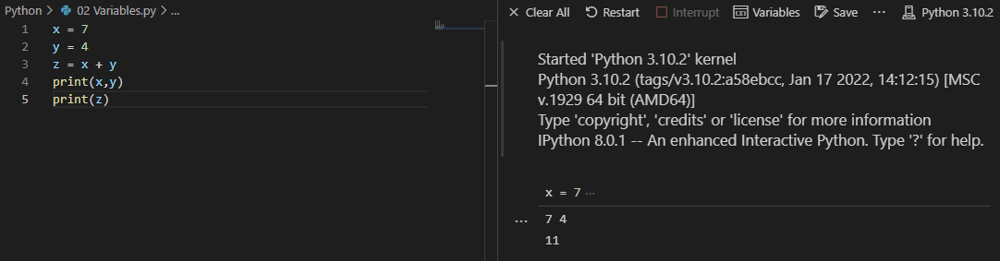
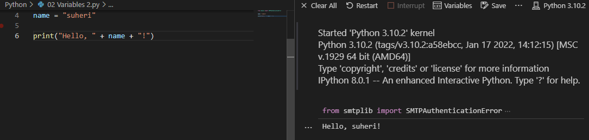
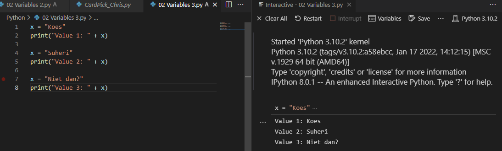

# **Variables**

## **Opdracht 1**

    Create a new script.
    Create two variables x and y. Assign a numerical value to both variables.
    Print the values of x and y.
    Create a third variable named z. The value of z should be the sum of x and y.
    Print the value of z.

[Code](../Python/01Variables1.py)

## **Opdracht 2**

    Create a new script.
    Create a variable name. The value of name should be your name.
    Print the text “Hello, <your name here>!”. Use name in the print statement.

[Code](../Python/01Variables2.py)

## **Opdracht 3**

    Create a new script.
    Create a variable and assign a value to it.
    Print the text “Value 1: <value 1 here>”.
    Change the value of that same variable.
    Print the text “Value 2: <value 2 here>”.
    Change the value of that same variable.
    Print the text “Value 3: <value 3 here>”.

[Code](../Python/01Variables3.py)

### **Gebruikte bronnen**

*<https://www.w3schools.com/python/python_variables.asp>*