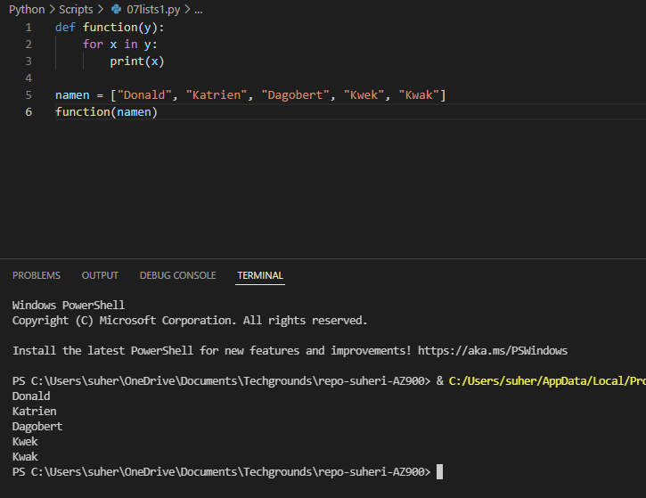
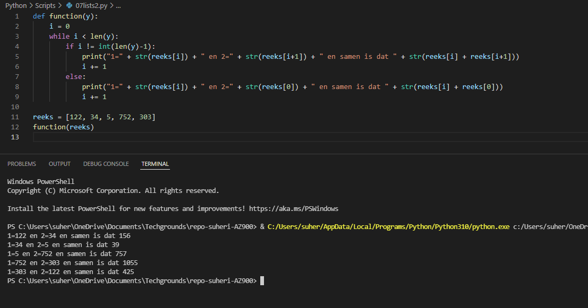

# **Lists**

## **Opdracht 1**

    Create a new script.
    Create a variable that contains a list of five names.
    Loop over the list using a for loop. Print every individual name in the list on a new line.

[Code](../Python/Scripts/07lists1.py)

## **Opdracht 2**

    Create a new script.
    Create a list of five integers.
    Use a for loop to do the following for every item in the list:
    Print the value of that item added to the value of the next item in the list. 
    If it is the last item, add it to the value of the first item instead (since there is no next item).

[Code](../Python/Scripts/07lists2.py)

### **Gebruikte bronnen**

*<https://www.w3schools.com/python/python_while_loops.asp>*
